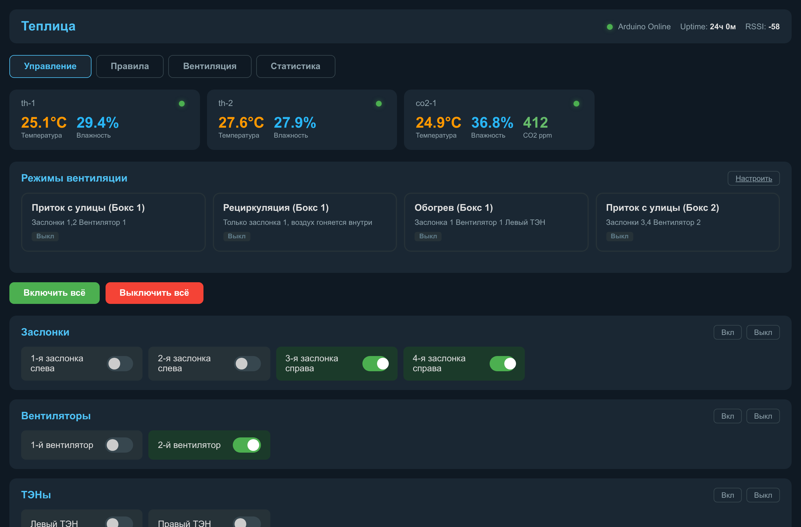
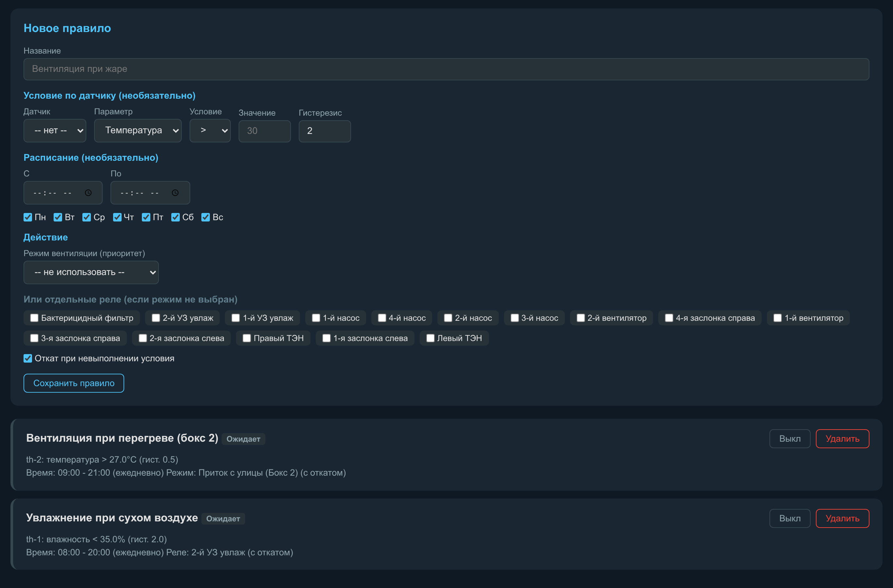
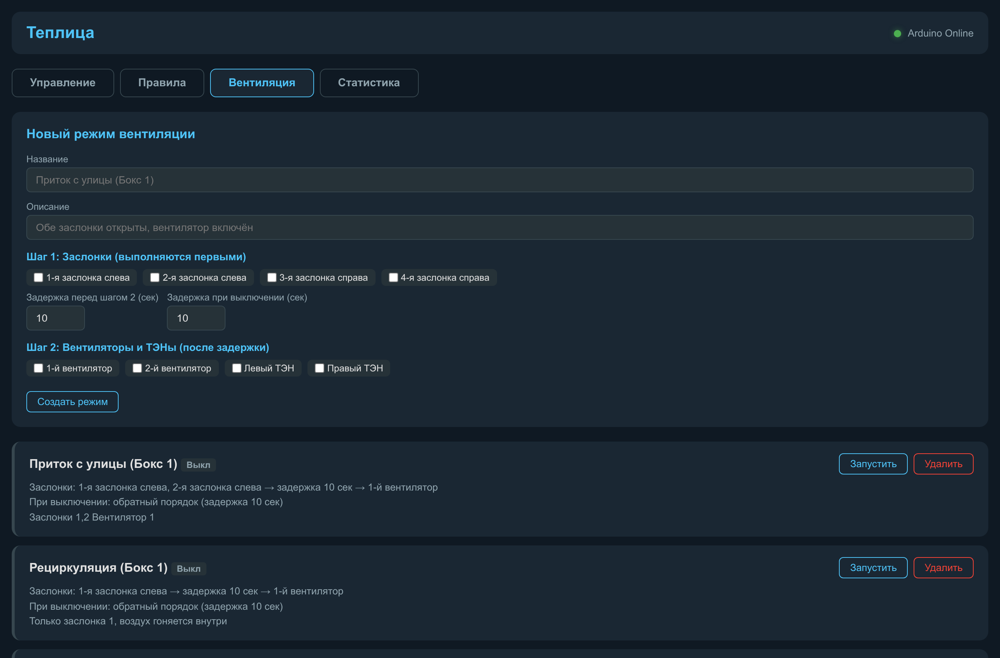
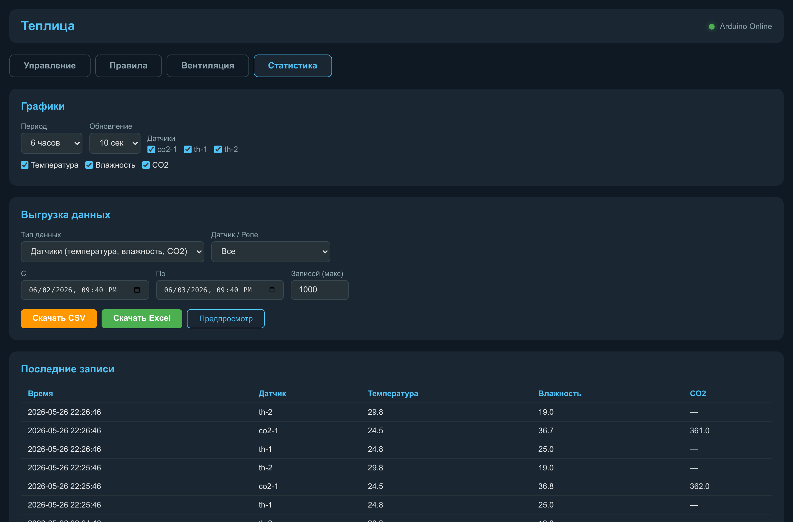

# Черновик приложений

Этот файл содержит готовые заготовки приложений к ВКР. Материалы можно переносить в итоговый документ после согласования формата приложений с требованиями кафедры.

## Приложение А. Фрагменты прошивки контроллера реле

Источник: `Greenhouse/firmware/greenhouse_mega/greenhouse_mega.ino`.

Назначение контроллера: прием MQTT-команд, переключение 15 релейных каналов, публикация подтвержденных состояний и диагностической сводки.

### А.1. Основные параметры

```cpp
const char* WIFI_SSID    = "Greenhouse";
const char* WIFI_PASS    = "77777777";

const char* MQTT_HOST    = "192.168.1.112";
const uint16_t MQTT_PORT = 1883;

const char* DEVICE_ID    = "mega-1";
const char* BASE         = "greenhouse";

#define NUM_RELAYS     15
#define SUMMARY_MS     60000UL
#define WIFI_RETRY_MS  5000UL
#define MQTT_RETRY_MS  5000UL
```

### А.2. Релейные выходы

```cpp
uint8_t RELAY_PINS[NUM_RELAYS] = {
  22, 24, 26, 28, 30, 32, 34, 36, 38, 40, 42, 44, 46, 48, 50
};
const bool RELAY_ACTIVE_LOW = false;
```

### А.3. Публикация состояния реле

```cpp
void publishRelayState(uint8_t idx) {
  if (!mqtt.connected() || idx >= NUM_RELAYS) return;
  char topic[64];
  snprintf(topic, sizeof(topic), "%s/relay/%u/state", BASE, idx + 1);
  mqtt.publish(topic, relayState[idx] ? "ON" : "OFF", true);
}
```

### А.4. Обработка MQTT-команд

Контроллер принимает топики вида `greenhouse/relay/<N|all>/<set|get>`. Команда `set` меняет состояние, команда `get` публикует текущее состояние без изменения реле.

Поддерживаются команды: `ON` (или `1`) - включить реле; `OFF` (или `0`) - выключить реле; `TOGGLE` - переключить состояние на противоположное. После выполнения команды контроллер публикует подтвержденное состояние канала в соответствующий топик `state`, поэтому веб-панель всегда отображает фактическое, а не предполагаемое положение реле.

## Приложение Б. Фрагменты прошивок сенсорных узлов

### Б.1. Узел температуры и влажности

Источник: `Greenhouse/firmware/sensor_th/sensor_th.ino`.

```cpp
const char* DEVICE_ID = "th-1";
#define DHT_PIN   2
#define DHT_TYPE  DHT11
#define READ_INTERVAL_MS   10000UL

snprintf(topicState, sizeof(topicState), "greenhouse/env/%s/state", DEVICE_ID);
snprintf(topicLWT, sizeof(topicLWT), "greenhouse/%s/status", DEVICE_ID);
```

Формат сообщения:

```json
{"ts":123456,"device":"th-1","t":24.5,"h":61.0}
```

### Б.2. Узел CO2

Источник: `Greenhouse/firmware/sensor_co2/sensor_co2.ino`.

```cpp
const char* DEVICE_ID = "co2-1";

#define SDA_PIN   4
#define SCL_PIN   5
#define READ_INTERVAL_MS   5000UL

snprintf(topicState, sizeof(topicState), "greenhouse/env/%s/state", DEVICE_ID);
snprintf(topicLWT, sizeof(topicLWT), "greenhouse/%s/status", DEVICE_ID);
```

Формат сообщения:

```json
{"ts":123456,"device":"co2-1","co2":820,"t":24.7,"h":60.5}
```

В прошивке предусмотрена фильтрация некорректных значений CO2: значения меньше 0 ppm и больше 10 000 ppm не публикуются.

## Приложение В. MQTT-топики и форматы сообщений

| Направление | Топик | Payload | Назначение |
|---|---|---|---|
| sensor -> broker | `greenhouse/​env/​th-1/​state` | JSON `ts`, `device`, `t`, `h` | температура и влажность |
| sensor -> broker | `greenhouse/​env/​co2-1/​state` | JSON `ts`, `device`, `co2`, `t`, `h` | CO2, температура, влажность |
| device -> broker | `greenhouse/​<device>/​status` | `online` / `offline` | доступность узла |
| dashboard -> relay | `greenhouse/​relay/​<n>/​set` | `ON`, `OFF`, `TOGGLE`, `1`, `0` | команда на реле |
| dashboard -> relay | `greenhouse/​relay/​all/​set` | `ON`, `OFF`, `TOGGLE`, `1`, `0` | команда на все реле |
| dashboard -> relay | `greenhouse/​relay/​<n>/​get` | любое сообщение | запрос состояния |
| relay -> broker | `greenhouse/​relay/​<n>/​state` | `ON` / `OFF` | подтвержденное состояние |
| relay -> broker | `greenhouse/​relay/​summary` | JSON | диагностическая сводка |
| relay -> broker | `greenhouse/​mega-1/​status` | `online` / `offline` | состояние контроллера |

Пример сводки контроллера:

```json
{
  "ts": 123456,
  "device": "mega-1",
  "uptime": 3600,
  "wifi_rc": 3,
  "mqtt_rc": 0,
  "rssi": -61,
  "relays": {"1": false, "2": false, "3": true}
}
```

## Приложение Г. Структура базы данных

Источник: `Greenhouse/dashboard/app.py`.

### Г.1. Таблица `sensor_log`

| Поле | Тип | Назначение |
|---|---|---|
| `id` | INTEGER PRIMARY KEY AUTOINCREMENT | идентификатор записи |
| `ts` | TEXT | время записи |
| `device` | TEXT | идентификатор датчика |
| `temperature` | REAL | температура |
| `humidity` | REAL | относительная влажность |
| `co2` | REAL | концентрация CO2 |

### Г.2. Таблица `relay_log`

| Поле | Тип | Назначение |
|---|---|---|
| `id` | INTEGER PRIMARY KEY AUTOINCREMENT | идентификатор записи |
| `ts` | TEXT | время записи |
| `relay_id` | INTEGER | номер реле |
| `state` | INTEGER | состояние 0/1 |

### Г.3. Индексы

Для ускорения выборок по временным интервалам в базе созданы два индекса: `idx_sensor_ts` по полю `ts` таблицы `sensor_log` и `idx_relay_ts` по полю `ts` таблицы `relay_log`. Индексация по временной метке выбрана потому, что все аналитические запросы платформы (графики, экспорт, окна до/после событий реле) фильтруют историю именно по диапазону времени.

### Г.4. SQL-проверка

```sql
select ts, device, temperature, humidity, co2
from sensor_log
order by id desc
limit 5;

select ts, relay_id, state
from relay_log
order by id desc
limit 5;
```

## Приложение Д. Реле и исполнительные устройства

| Реле | Имя по умолчанию | Группа |
|---:|---|---|
| 1 | Бактерицидный фильтр | Фильтры |
| 2 | 2-й УФ фильтр | Фильтры |
| 3 | 1-й УФ фильтр | Фильтры |
| 4 | 1-й насос | Насосы |
| 5 | 4-й насос | Насосы |
| 6 | 2-й насос | Насосы |
| 7 | 3-й насос | Насосы |
| 8 | 2-й вентилятор | Вентиляторы |
| 9 | 4-я заслонка справа | Заслонки |
| 10 | 1-й вентилятор | Вентиляторы |
| 11 | 3-я заслонка справа | Заслонки |
| 12 | 2-я заслонка слева | Заслонки |
| 13 | Правый ТЭН | ТЭНы |
| 14 | 1-я заслонка слева | Заслонки |
| 15 | Левый ТЭН | ТЭНы |

## Приложение Е. Веб-интерфейс оператора

Веб-панель оператора реализована на Flask. Ниже приведены снимки экрана основных страниц панели, полученные при работе системы с фактической базой истории и конфигурацией опытного объекта.

Главная страница (рисунок Е.1) отображает текущие показания всех датчиков, статус контроллера, режимы вентиляции и переключатели каждого релейного канала по группам оборудования.



Страница правил автоматизации (рисунок Е.2) позволяет задать условие по датчику с гистерезисом, расписание по дням недели и времени, а также действие - вентиляционный режим или отдельные реле; ниже формы отображается список действующих правил.



Страница вентиляционных режимов (рисунок Е.3) содержит конструктор профилей с двумя шагами (заслонки, затем вентиляторы и ТЭНы) и задержками, а также список созданных режимов с описанием последовательности действий.



Страница статистики (рисунок Е.4) предоставляет графики истории по выбранным датчикам и параметрам, выгрузку данных в CSV и Excel за произвольный период и таблицу последних записей журнала.



## Приложение Ж. План ML-эксперимента

Сокращенная постановка:

| Элемент | Описание |
|---|---|
| Исходные данные | `sensor_log`, `relay_log` |
| Горизонты прогноза | 10, 30 и 60 минут |
| Целевые переменные | температура, влажность, CO2 |
| Базовые признаки | лаги, скользящие агрегаты, время суток, состояния реле |
| Baseline | последнее значение, скользящее среднее |
| ML-модели | Random Forest, Gradient Boosting, LSTM/GRU при достаточном объеме данных |
| Метрики | MAE, RMSE, R² |

Подробный план приведен в плане ML-эксперимента проекта.
