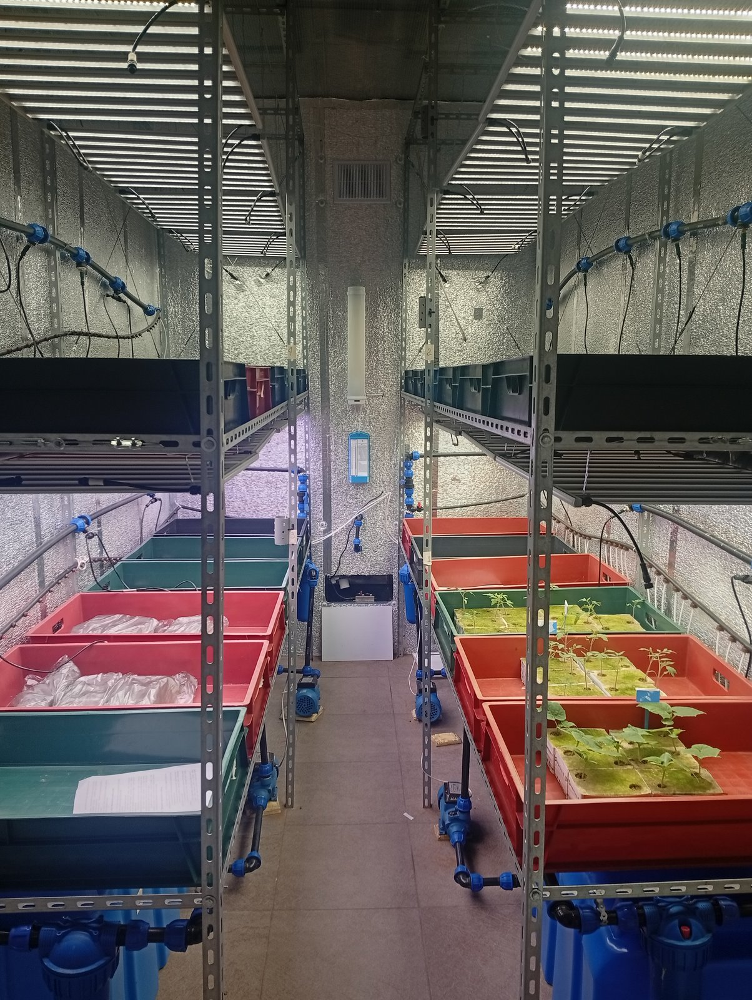
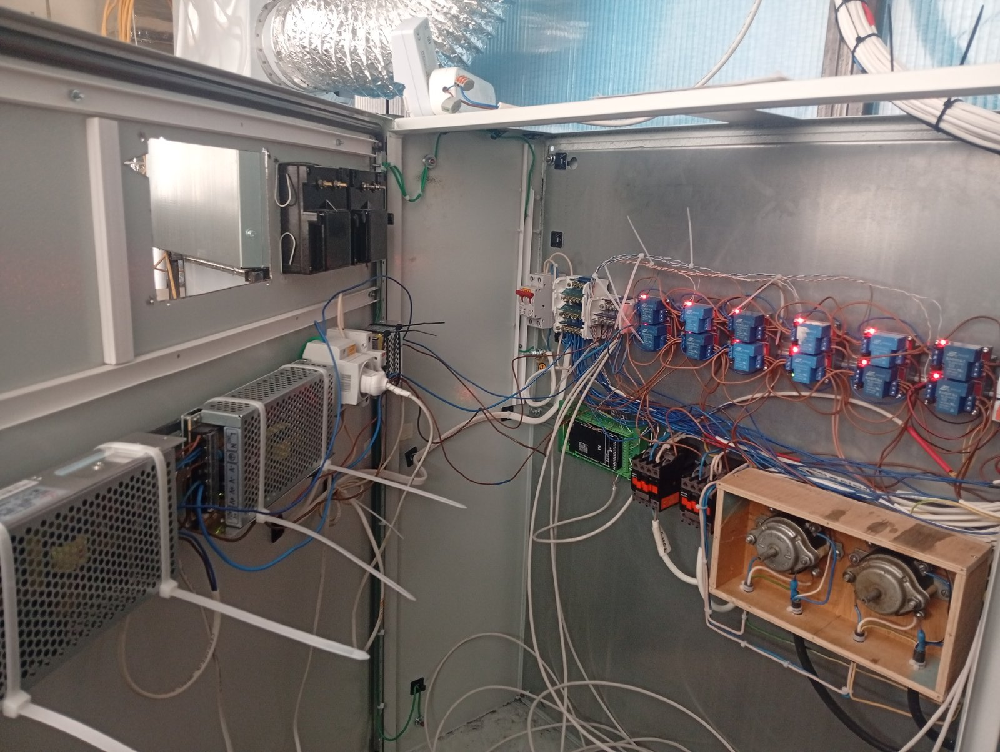
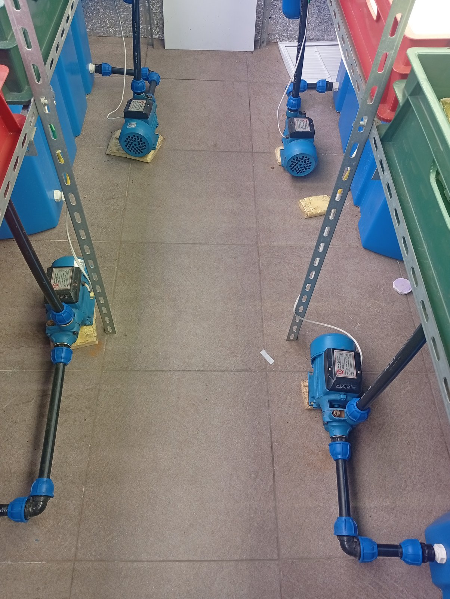
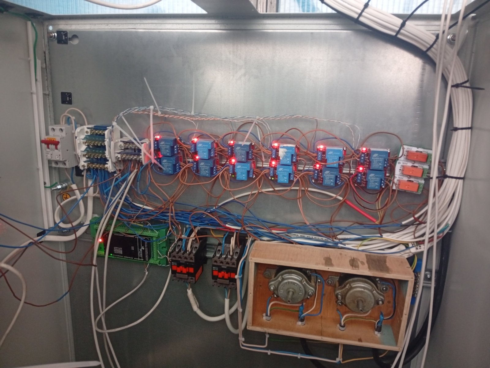

# Разработка и внедрение интеллектуальной системы управления микроклиматом в теплице на основе машинного обучения

> Рабочий собранный Markdown-черновик. Файл генерируется скриптом `thesis/build_assembled_draft.sh`; править лучше исходные части, а не этот файл.

## Содержание

1. Аннотация
2. Список сокращений и обозначений
3. Введение
4. Глава 1. Аналитический обзор систем интеллектуального управления микроклиматом теплицы
5. Глава 2. Проектирование расширяемой IoT/ML-платформы управления микроклиматом теплицы
6. Глава 3. Реализация, опытное внедрение и анализ данных платформы
7. Заключение
8. Список литературы


# Аннотация

Выпускная квалификационная работа посвящена разработке интеллектуальной системы управления микроклиматом теплицы на основе машинного обучения. Теплица рассматривается как теплотехнический и киберфизический объект, в котором температурный режим, влажность, воздухообмен и концентрация углекислого газа должны анализироваться совместно с управляющими воздействиями.

Цель работы состоит в обосновании, разработке и опытном внедрении расширяемой IoT/ML-платформы для мониторинга, журналирования и последующего прогнозного управления микроклиматом теплицы, в которой разнородные датчики и исполнительные устройства подключаются через единую модель обмена данными.

В аналитической части рассмотрены современные подходы к smart greenhouse, IoT-архитектурам, прогнозированию микроклимата, предиктивному управлению, обучению с подкреплением, энергоэффективности и обработке неоднородных потоков сенсорных данных. В проектной части разработаны архитектура платформы, реестр устройств и метрик, унифицированная модель MQTT-обмена, математический каркас тепловлажностного режима и расчетная модель экономического эффекта. В практической части реализован и внедрен прототип (сенсорные узлы, релейный контроллер на 15 каналов, MQTT-брокер, web-dashboard, правила и профили, SQLite-журнал) на опытном тепличном боксе объемом 24 м³; получена история эксплуатации за период с 28 марта по 26 мая 2026 года (около 244 тыс. сенсорных записей и 165 событий реле). Выполнен разведочный анализ данных, выявивший суточную динамику, пространственный градиент температуры между боксами, хронически высокий дефицит давления водяного пара и нелинейную связь световой дозы с урожаем и качеством салата, а также baseline-эксперимент машинного обучения по краткосрочному прогнозу температуры, влажности и CO2.

Ключевые слова: теплица, микроклимат, тепловлажностный режим, интеллектуальное управление, интернет вещей, машинное обучение, прогнозирование, энергоэффективность.


# Список сокращений и обозначений

| Сокращение | Расшифровка | Пояснение в контексте работы |
|---|---|---|
| АСУ | автоматизированная система управления | система наблюдения и управления параметрами микроклимата |
| ВКР | выпускная квалификационная работа | итоговая квалификационная работа магистранта |
| ИИ | искусственный интеллект | методы анализа данных и поддержки принятия решений |
| IoT | internet of things | подход к объединению датчиков, исполнительных устройств и программных сервисов |
| ML | machine learning | машинное обучение, применяемое для анализа и прогнозирования временных рядов |
| MQTT | message queuing telemetry transport | легкий протокол обмена сообщениями в IoT-системах |
| CO2 | carbon dioxide | концентрация углекислого газа в воздухе теплицы |
| MPC | model predictive control | модельно-предиктивное управление |
| RL | reinforcement learning | обучение с подкреплением |
| MAE | mean absolute error | средняя абсолютная ошибка прогноза |
| RMSE | root mean squared error | корень из средней квадратичной ошибки прогноза |


# Введение

Современные тепличные комплексы требуют точного контроля параметров микроклимата: температуры, влажности, концентрации CO2, режимов вентиляции, нагрева, увлажнения и полива. С теплотехнической точки зрения теплица является объектом с тепловым балансом, влажностным режимом и вентиляционным воздухообменом. Даже в малой теплице параметры изменяются не изолированно: включение вентилятора влияет на температуру и влажность, открытие заслонок меняет воздухообмен, работа нагревателей имеет инерционный эффект, а концентрация CO2 зависит от вентиляции, фотосинтетической активности растений и притока наружного воздуха. Поэтому управление микроклиматом нельзя сводить только к ручному включению оборудования или простым пороговым действиям без накопления истории.

Актуальность работы связана с переходом тепличных систем от локальной автоматики к киберфизическим IoT-решениям. В современных исследованиях smart greenhouse рассматривается как система, объединяющая датчики, исполнительные механизмы, сетевой обмен, хранилище данных, веб-интерфейс и интеллектуальный аналитический слой [elouaham2026smartgreenhouses; bersani2022iotsmartgreenhouse]. Такая постановка особенно важна для малых и учебно-экспериментальных теплиц: если система проектируется только под один датчик и одно реле, она быстро перестает быть исследовательской платформой. Для дальнейшего применения машинного обучения требуется расширяемая архитектура, в которой новые сенсорные узлы, исполнительные каналы и расчетные признаки подключаются без переписывания всей системы.

Отдельное значение имеет энергоэффективность. Нагрев, вентиляция, увлажнение и освещение потребляют значительные ресурсы, а вентиляционные воздействия могут приводить к теплопотерям [chen2025environmentcontrolreview; ghaderi2023heatrecoverygreenhouse]. При этом реакция теплицы на управляющее воздействие зависит от текущего состояния среды, внешних условий, инерции конструкций, плотности растений и режима воздухообмена. Поэтому управление должно учитывать не только текущие значения датчиков, но и прогноз развития микроклимата [aborujilah2025forecastlstm; wu2026agriculturalenergyinternet].

Методы машинного обучения позволяют использовать накопленную телеметрию для прогнозирования температуры, влажности, CO2, роста растений и урожайности. В литературе применяются LSTM, RNN, TCN, Transformer и вероятностные модели, ориентированные на временные ряды тепличных данных [alhnaity2019plantgrowth; gong2021tcnrnnyield; ahn2024transformerrnngreenhouse; choi2025probabilisticmicroclimate]. Однако для практического применения таких моделей сначала необходим надежный инженерный слой: датчики должны стабильно публиковать данные, исполнительные устройства должны управляться через понятный интерфейс, а история измерений и воздействий должна сохраняться в пригодном для анализа виде.

В рамках данной работы рассматривается разработка и опытное внедрение расширяемой программно-аппаратной IoT/ML-платформы мониторинга и управления микроклиматом теплицы. Платформа объединяет микроконтроллеры, MQTT-брокер, веб-панель оператора, правила автоматизации, профили управления, журналирование данных и подготовку истории для машинного обучения. Реальная история измерений и управляющих воздействий необходима для перехода от эмпирического управления к имитационной или ML-модели тепловлажностного режима [samarin2025simulationmicroclimate; ogunlowo2021heatmassgreenhouse]. Машинное обучение в работе рассматривается как верхний интеллектуальный слой, который опирается на данные, собранные инженерной системой. Такой подход позволяет сохранить надежность базового управления и одновременно подготовить основу для прогнозных моделей и дальнейшего интеллектуального управления.

Цель работы: разработать и внедрить расширяемую IoT/ML-платформу мониторинга и управления тепловлажностным режимом теплицы с возможностью подключения разнородных датчиков, управления исполнительными устройствами, накопления истории и последующего применения методов машинного обучения для прогнозирования и интеллектуальной поддержки управления.

Для достижения цели необходимо решить следующие задачи:

1. Проанализировать современные подходы к автоматизации микроклимата теплиц, IoT-архитектурам, прогнозированию микроклимата и интеллектуальному управлению.
2. Определить требования к расширяемой системе мониторинга и управления: состав параметров, датчики, исполнительные механизмы, канал связи, хранение данных, интерфейс оператора и пригодность истории для ML-анализа.
3. Спроектировать архитектуру системы на базе микроконтроллеров, MQTT, серверного приложения, базы данных истории и единой модели обмена сообщениями.
4. Реализовать программно-аппаратный контур: сенсорные узлы, релейный контроллер, MQTT-обмен, dashboard, журналирование показаний и состояний.
5. Подготовить основу для интеллектуального слоя: накопление временных рядов, экспорт данных, правила и профили управления, план ML-эксперимента.
6. Проверить работоспособность системы на опытном объекте, сформировать датасет эксплуатации и определить направления дальнейшего развития.

Объект исследования: тепловлажностный режим теплицы как управляемая киберфизическая система агропромышленного комплекса.

Предмет исследования: методы и программно-аппаратные средства мониторинга, управления и интеллектуальной поддержки регулирования микроклимата теплицы.

Методы исследования. В работе использованы методы системного анализа и обзора научной литературы для обоснования архитектурной рамки; методы проектирования распределенных IoT-систем и протокола обмена на основе MQTT; натурный эксперимент - опытное внедрение программно-аппаратного комплекса на реальном тепличном объекте и накопление истории измерений. Для обработки данных применены методы предварительной очистки и контроля качества временных рядов (фильтрация технических нулей, анализ пропусков), описательная и разведочная статистика (суточные и почасовые профили, парные сравнения датчиков, корреляционный и лаговый анализ), расчет производных физических показателей (DLI по PPFD, дефицит давления водяного пара VPD по формуле Тетенса), анализ естественных экспериментов по событиям включения оборудования, а также методы машинного обучения для baseline-прогноза (наивный прогноз, скользящее среднее, регуляризованная линейная регрессия) с оценкой по метрикам MAE, RMSE и коэффициенту детерминации R². Расчеты выполнены в среде Python.

Практическая значимость работы состоит в создании системы, которая может использоваться как основа для эксплуатации малой теплицы и для дальнейших экспериментов с прогнозированием микроклимата. Реализованная архитектура позволяет собирать телеметрию, управлять исполнительными устройствами, хранить историю и формировать датасет для машинного обучения.

Научная новизна работы заключается в архитектурно-методическом подходе к построению малой теплицы как расширяемой IoT/ML-платформы. В отличие от одноразовой схемы «датчик - реле - панель управления», в работе рассматривается единый контур, где разнородные датчики публикуют данные в общей модели обмена, управляющие воздействия регистрируются совместно с параметрами микроклимата, а накопленная история становится основой для последующего ML-прогнозирования реакции теплицы. При этом не заявляется разработка нового алгоритма машинного обучения: интеллектуальный слой рассматривается как прогнозная надстройка над безопасным правиловым контуром.

Структура работы включает введение, три главы, заключение, список литературы и приложения. В первой главе приведен аналитический обзор источников по smart greenhouse, IoT, прогнозированию и методам управления. Во второй главе описано проектирование системы. В третьей главе рассмотрены реализация, проверка работоспособности и подготовка ML-эксперимента.


# Глава 1. Аналитический обзор систем интеллектуального управления микроклиматом теплицы

## 1.1. Теплица как киберфизическая система управления

Современная теплица является не просто защищенным сооружением для выращивания растений, а киберфизической системой, в которой датчики, исполнительные механизмы, микроконтроллеры, серверное программное обеспечение и алгоритмы принятия решений работают как единый контур. Целевыми параметрами такого контура выступают температура воздуха, относительная влажность, концентрация CO2, освещенность, влажность почвы или субстрата, режим полива и состояние растений. Поддержание этих параметров влияет на урожайность, скорость роста, устойчивость растений к стрессу и энергоемкость выращивания.

В обзорной литературе последних лет тепличное хозяйство все чаще рассматривается через призму smart greenhouse, то есть управляемой среды, где IoT, искусственный интеллект, спектральные датчики, мультимодальное слияние данных и интеллектуальные системы используются для повышения эффективности выращивания. В обзоре показано, что развитие smart greenhouse связано не только с заменой ручного контроля на датчики, но и с переходом к системам, которые собирают разнородные данные, анализируют их и поддерживают принятие решений [elouaham2026smartgreenhouses]. Для данной ВКР это принципиально: ценность системы определяется не только тем, что она измеряет температуру и включает реле, а тем, что она создает расширяемый контур данных для последующего прогнозирования и анализа реакции теплицы.

Русскоязычные источники подтверждают ту же постановку на инженерном уровне. В сравнительном анализе современных систем автоматизированного управления микроклиматом подчеркивается, что автоматизация теплиц направлена на снижение эксплуатационных затрат, повышение урожайности и переход от простого поддержания параметров к интеллектуальному управлению [vanharisov_cyberleninka]. Халина и Цыбанюк описывают базовую структуру автоматизированной системы: датчики измеряют параметры среды, блок управления сравнивает их с заданными значениями, после чего исполнительные механизмы изменяют температуру, влажность, освещение или другие параметры [khalina2020greenhousecontrol]. Такая схема является исходной, но в современных условиях она требует расширения прогнозными и аналитическими функциями.

Особенность тепличного микроклимата состоит в инерционности и взаимосвязанности параметров. Нагрев, вентиляция, увлажнение, подача CO2 и освещение влияют друг на друга, а реакция растений проявляется не мгновенно. Тарков и Сукьясов рассматривают задачу управления параметрами микроклимата через уравнения баланса и отмечают проблему запаздывания процесса регулирования [tarkov2025microclimatemodel]. Это означает, что реактивное управление по текущему отклонению от уставки не всегда обеспечивает оптимальный результат: система может опоздать с воздействием или создать избыточные энергетические затраты.

## 1.2. Тепловлажностный режим и энергетическая рамка теплицы

Для направления «Теплотехника и теплоэнергетика в агропромышленном комплексе» принципиально важно рассматривать теплицу как объект тепло- и массообмена. Температура, влажность и CO2 формируются под действием солнечной радиации, теплопотерь через ограждения, вентиляционного воздухообмена, испарения и транспирации растений, нагрева, увлажнения и работы вспомогательного оборудования. В обзоре тепличная система прямо описывается как сложная многовходовая и многовыходовая система, где управление температурой, влажностью, светом, CO2 и воздушными потоками должно одновременно обеспечивать рост растений и энергосбережение [chen2025environmentcontrolreview].

Динамические модели микроклимата теплицы обычно опираются на баланс энергии, энтальпии и массы. Это важно для текущей ВКР: даже если практическая реализация использует датчики и реле, физическая сущность задачи остается теплотехнической. Самарин и др. формулируют задачу имитационного моделирования оптимального управления микроклиматом сельскохозяйственного объекта через температурно-влажностный режим, тепловой баланс, влажностное состояние конструкций и энергосберегающий режим выращивания [samarin2025simulationmicroclimate]. Такой подход поддерживает выбранную рамку: система должна не только включать устройства, но и формировать данные для модели поведения теплицы.

Отдельная проблема состоит в пространственной неоднородности микроклимата. В работе показано, что распределение тепла и массы в одно- и многопролетных теплицах влияет на точность оценки энергетической потребности; при игнорировании распределения параметров возможна переоценка или недооценка расчетов [ogunlowo2021heatmassgreenhouse]. Это обосновывает применение нескольких измерительных узлов внутри теплицы и последующий анализ расхождений между датчиками, а не только использование одного среднего значения.

Вентиляция является одним из ключевых каналов воздействия на микроклимат. Она одновременно снижает температуру, удаляет влагу, изменяет воздухообмен и влияет на концентрацию CO2. В работе на данных девяти односкатных теплиц показано, что открытие вентиляции меняет температуру, относительную влажность, VPD и CO2, а эффект зависит от плотности посадки, высоты растений, внутренних покрытий и времени открытия вентиляционного проема [li2023heathumidityventilation]. Поэтому события включения вентиляторов и приточных каналов в собственной системе должны журналироваться вместе с температурой, влажностью и CO2: без этого невозможно корректно анализировать реакцию теплицы на управляющее воздействие.

Энергетический аспект особенно заметен при управлении вентиляцией и отоплением. В работе отмечается, что вентиляционные потери тепла являются одним из значимых факторов энергетической эффективности теплиц, а климат-контроль может составлять основную долю энергопотребления тепличного хозяйства [ghaderi2023heatrecoverygreenhouse]. Следовательно, интеллектуальный слой управления должен стремиться не только удерживать параметры в допустимом диапазоне, но и снижать лишние переключения, преждевременные теплопотери и компенсирующие действия после запаздывания.

## 1.3. IoT-архитектура и расширяемость тепличных систем

Практическое внедрение интеллектуального управления начинается с надежного сбора телеметрии. IoT-подходы позволяют связать датчики, исполнительные устройства, контроллеры и программные сервисы в единую инфраструктуру. В работе smart greenhouse рассматривается в контексте Industry 4.0 и показано, что IoT-системы для теплиц включают сенсорные сети, каналы связи, удаленный мониторинг и управляющие контуры [bersani2022iotsmartgreenhouse]. Такой подход хорошо согласуется с текущим проектом, где уже присутствуют прошивки микроконтроллеров и серверный dashboard.

В инженерных реализациях часто используются микроконтроллеры, Raspberry Pi, Arduino/ESP, MQTT, веб-интерфейсы и базы данных. Кельсин в ВКР по автоматизированной системе управления тепличным хозяйством рассматривает архитектуру на микроконтроллерах, близкую к практическим учебным и малым производственным системам [kelsin2021greenhousemicrocontrollers]. Статья по MQTT-based smart greenhouse monitoring дополнительно показывает, почему MQTT удобен для телеметрии: это легкий протокол обмена сообщениями, пригодный для IoT-устройств с ограниченными ресурсами [mqtt2020greenhouse]. Для текущей ВКР это важно, поскольку коммуникационный слой должен быть достаточно простым для микроконтроллеров и достаточно надежным для накопления данных.

Для перехода от локальной автоматики к платформе недостаточно просто добавить веб-интерфейс. Система должна иметь расширяемую модель подключаемых устройств: разные датчики могут измерять температуру, влажность, CO2, освещенность, влажность субстрата или дополнительные расчетные параметры, но для верхнего уровня они должны попадать в историю в сопоставимой структуре. Такой подход согласуется с направлением multimodal data fusion в smart greenhouse: данные от разных источников становятся не разрозненными показаниями, а общей информационной базой для анализа состояния растений и микроклимата [elouaham2026smartgreenhouses]. В практической архитектуре это означает необходимость идентификатора устройства, типа метрики, времени измерения, единиц измерения и признака качества данных.

Расширяемость важна и для исполнительных устройств. В малой теплице реле может управлять вентилятором, заслонкой, насосом, увлажнителем или нагревателем, но для анализа микроклимата все эти действия должны фиксироваться как события воздействия на тепловлажностный режим. Без совместной регистрации датчиков и реле невозможно отличить естественное изменение температуры от реакции на вентиляцию или нагрев. Поэтому журнал исполнительных воздействий является не вспомогательной функцией dashboard, а обязательной частью ML-ready датасета.

Прикладные smart farming эксперименты демонстрируют, что тепличная система должна рассматриваться как полный стек: датчики, исполнительные механизмы, логика управления, хранение данных и интерфейс оператора. В работе описан IoT-проект теплицы для выращивания риса, где IoT-инфраструктура связывает параметры среды и агротехническую задачу [joni2025iotricegreenhouse]. Несмотря на отличие культуры, работа полезна как пример построения комплексной системы. Авторы работы идут еще дальше и связывают прогноз микроклимата с веб-интеграцией и адаптивным управлением оборудованием [thwin2024microclimateweb]. Это особенно важно для данной ВКР, так как собственный проект уже содержит dashboard, прошивки и историю событий, а значит может быть описан как первый инкремент интеллектуального контура, а не как завершенная одноцелевая автоматика.

Отдельно следует отметить работы, где IoT-инфраструктура связывается с reinforcement learning. В работе рассматривается интеграция IoT и RL для оптимизированного управления климатом [platero2024iotrlgreenhouse]. Для текущей ВКР этот источник важен не как требование немедленно реализовать RL-агента, а как подтверждение архитектурного тезиса: интеллектуальный регулятор возможен только там, где есть непрерывная телеметрия, наблюдаемые исполнительные воздействия и воспроизводимый обмен данными.

## 1.4. Прогнозирование микроклимата, роста и урожайности

Накопление телеметрии само по себе не делает систему интеллектуальной. Интеллектуальный слой появляется тогда, когда исторические данные используются для прогнозирования будущего состояния микроклимата, роста растений или урожайности. В работе LSTM применяется для прогнозирования роста и урожайности в тепличной среде и показано, что последовательностные модели способны извлекать полезные зависимости из временных рядов тепличных данных [alhnaity2019plantgrowth]. В работе предложена связка TCN и RNN для прогнозирования урожайности в сравнении с классическими ML-подходами [gong2021tcnrnnyield]. Эти работы обосновывают использование истории наблюдений, а не только текущего значения датчика.

Для задачи управления микроклиматом особенно важны работы, где прогнозируются непосредственно температура, влажность и CO2. В работе сравниваются transformer- и RNN-модели для предсказания температуры, относительной влажности и концентрации CO2 в теплице [ahn2024transformerrnngreenhouse]. В работе используется Attention CNN-LSTM для прогнозирования среды грибной теплицы, также с температурой, влажностью и CO2 [huang2024attentioncnnlstm]. Эти источники показывают, что микроклимат является естественным объектом для time-series prediction, а не только для порогового контроля. При этом качество прогноза зависит не только от выбора модели, но и от состава признаков: полезными могут быть лаги датчиков, время суток, сезонность, состояние вентиляции, нагрева и увлажнения, а также различия между точками измерения.

Отдельное направление связано с прогнозным управлением и энергоэффективностью. В работе рассматривается прогнозно-ориентированное управление климатом smart greenhouse: LSTM-модель используется для упреждающих корректировок, направленных на снижение энергетических затрат [aborujilah2025forecastlstm]. В работе описано управление климатом теплицы на основе данных при выращивании салата с использованием прогнозного управления на BiLSTM и GRU [soumo2026bilstmgrugreenhouse]. В работе предложена многомерная многошаговая LSTM-модель, которая прогнозирует микроклимат и взаимодействует с системой управления оборудованием через веб-интеграцию [thwin2024microclimateweb]. В совокупности эти работы позволяют обосновать, что прогнозный слой может быть включен в практическую АСУ теплицы.

При этом прогнозы не следует рассматривать как абсолютно надежные. Choi and Yang предлагают probabilistic deep learning framework для greenhouse microclimate prediction с учетом time-varying uncertainty и covariance analysis [choi2025probabilisticmicroclimate]. Для диплома этот источник важен методологически: даже если в прототипе применяется более простая модель, в тексте необходимо признавать неопределенность прогноза и необходимость защитных ограничений нижнего уровня управления.

## 1.5. Методы управления: PID, fuzzy, MPC, RL и эвристическая оптимизация

Классические системы управления теплицей часто строятся на пороговых правилах, PID-регуляторах или нечеткой логике. Их преимущество состоит в простоте, интерпретируемости и возможности реализации на микроконтроллерах. Воробьева и др. рассматривают интеллектуальную систему контроля температуры в теплице и сравнивают PID-регулирование с нечетким регулятором [vorobyeva2026greenhousetemperature]. Для инженерного проекта такие методы остаются важными, потому что нижний уровень управления должен быть предсказуемым и безопасным.

Однако при усложнении задачи возникает потребность в методах, которые учитывают будущую динамику, ограничения и стоимость ресурсов. Model Predictive Control является одним из основных подходов в научной литературе по greenhouse climate control, поскольку он использует модель системы для оптимизации управляющих воздействий на горизонте прогноза. В работе показано, что MPC явно учитывает физические ограничения, но сильно зависит от точности модели; для компенсации неопределенности предложена связка MPC и reinforcement learning [mallick2025rlbasedmpcgreenhouse]. RL-управляемый MPC для автономного управления теплицей рассматривается и в работе [msaad2025rlmpcgreenhouse].

Сравнение MPC и RL важно для корректного позиционирования ВКР. В работе MPC рассматривается как model-based подход, а RL - как learning-based подход к управлению климатом теплицы [morcego2023rlversusmpc]. MPC лучше интерпретируется и естественно работает с ограничениями, тогда как RL способен улучшать стратегию на основе данных, но требует осторожности из-за рисков обучения и безопасности. Поэтому для практической ВКР разумно описывать RL/MPC не как обязательную реализацию в полном объеме, а как верхний интеллектуальный слой, который может выдавать рекомендации или корректировать уставки, тогда как нижний контур остается защищенным.

Перспективным направлением является включение оператора или агронома в цикл обучения. В работе предложено интерактивное обучение с подкреплением с участием агронома (grower-in-the-loop) для управления климатом теплицы [xiao2025growerlooprl]. Такой подход хорошо соответствует практической логике внедрения: система может не заменять оператора полностью, а поддерживать его решения и использовать экспертную обратную связь.

Помимо MPC/RL, в литературе встречаются эвристические оптимизационные методы. В работе алгоритм искусственной пчелиной колонии используется для оптимизации энергопотребления и обеспечения комфорта растений в smart greenhouse [jawad2025abcgreenhouse]. Этот источник показывает, что задача управления микроклиматом может решаться не только нейросетями или MPC, но и другими оптимизационными методами. Для текущей работы это полезно как обзор альтернатив, но основная логика ВКР остается связанной с IoT, прогнозированием и гибридным управлением.

## 1.6. Энергоэффективность и устойчивость тепличного управления

Энергопотребление является одним из ключевых ограничений тепличного производства. Отопление, вентиляция, увлажнение, освещение и подача CO2 требуют ресурсов, а реактивное управление может приводить к избыточным включениям исполнительных механизмов. В работе прямо указывается на проблему реактивных стратегий и предлагается прогнозный подход с LSTM для снижения энергетических потерь [aborujilah2025forecastlstm]. Эту же линию поддерживает теплотехническая литература по вентиляционным потерям и интеграции отопления, охлаждения и вентиляции [ghaderi2023heatrecoverygreenhouse].

Более широкий энергетический контекст раскрывается в обзоре Wu and Fu по Agricultural Energy Internet [wu2026agriculturalenergyinternet]. В нем greenhouse environmental control рассматривается как энергетически управляемый процесс наряду с ирригацией, дополнительным освещением, логистикой и сельскохозяйственными машинами. Для ВКР этот источник полезен в разделе актуальности: интеллектуальное управление микроклиматом не только улучшает условия выращивания, но и связано с задачей рационального использования энергии.

Энергоэффективность также связана с архитектурой управления. Если система умеет прогнозировать состояние микроклимата, она может заранее выбирать более мягкие воздействия, снижать частоту резких переключений и избегать компенсирующих действий после запаздывания. Однако такие преимущества возможны только при наличии надежной телеметрии, устойчивого обмена данными и защитных правил нижнего уровня.

## 1.7. Выводы по аналитическому обзору

Проведенный обзор показывает, что тема интеллектуального управления микроклиматом теплицы находится на пересечении нескольких направлений: теплотехники, тепло- и массообмена, IoT-архитектур, автоматизированного управления, машинного обучения, прогнозирования временных рядов, энергоэффективности и человеко-ориентированного принятия решений. Практические инженерные источники описывают датчики, контроллеры, MQTT, dashboard и исполнительные механизмы, но часто ограничиваются пороговыми или простыми регуляторами. Современные научные работы предлагают LSTM, RNN, Transformer, Attention CNN-LSTM, вероятностные модели, MPC и RL, однако не всегда доводят эти методы до конкретной малой теплицы с реальной прошивкой, пользовательским интерфейсом и совместным журналированием измерений и воздействий.

На этом фоне текущая ВКР может быть обоснована как разработка и опытное внедрение расширяемой IoT/ML-платформы управления микроклиматом, которая создает основу для интеллектуального слоя. Нижний уровень системы должен обеспечивать сбор данных, безопасное управление и связь с исполнительными устройствами. Верхний уровень должен накапливать телеметрию, анализировать временные ряды, формировать прогнозы и поддерживать корректировку уставок. Научный разрыв, закрываемый работой, состоит не в создании нового ML-алгоритма, а в переходе от разрозненной автоматики к воспроизводимой платформе: разнородные датчики подключаются через единую модель обмена, события реле регистрируются вместе с микроклиматом, а история становится пригодной для ML-прогнозирования реакции теплицы. Такой гибридный подход согласует надежность практической АСУ с современными направлениями ML/MPC/RL и позволяет постепенно развивать систему без риска нереалистичного обещания полностью автономного AI-управления.


# Глава 2. Проектирование расширяемой IoT/ML-платформы управления микроклиматом теплицы

## 2.1. Назначение проектируемой платформы

Проектируемая система предназначена для мониторинга, журналирования и управления микроклиматом опытной теплицы. В рамках ВКР она рассматривается не как частная схема подключения одного датчика к одному реле, а как расширяемая программно-аппаратная IoT/ML-платформа. Такая постановка важна, поскольку интеллектуальное управление невозможно без устойчивого нижнего инженерного слоя: датчики должны регулярно публиковать данные, исполнительные устройства должны получать команды и подтверждать состояние, а история измерений и управляющих воздействий должна сохраняться в форме, пригодной для анализа.

Теплица в работе рассматривается как теплотехнический и киберфизический объект. Температура, относительная влажность, концентрация CO2, вентиляция, нагрев, увлажнение и освещение образуют взаимосвязанную систему. Изменение одного воздействия может менять сразу несколько параметров: вентиляция снижает концентрацию CO2 и влажность, но может увеличивать теплопотери; нагрев меняет температуру и относительную влажность; увлажнение влияет на влажностный режим и косвенно на тепловой баланс. Поэтому архитектура должна сохранять не только значения датчиков, но и события включения оборудования, иначе последующий анализ реакции микроклимата будет неполным.

Целевое назначение платформы состоит в том, чтобы обеспечить:

1. подключение разнородных сенсорных узлов;
2. управление исполнительными устройствами через единый контур команд;
3. отображение текущего состояния теплицы оператору;
4. хранение истории микроклимата и управляющих воздействий;
5. экспорт данных для статистического анализа и машинного обучения;
6. возможность развития от ручного и правилового управления к прогнозной поддержке решений.

Такой подход согласуется с современными представлениями о smart greenhouse, где IoT-инфраструктура, web-интерфейс, история данных и интеллектуальный слой являются частями единой системы [bersani2022iotsmartgreenhouse; elouaham2026smartgreenhouses; thwin2024microclimateweb].

## 2.2. Требования к системе

Требования к системе разделены на функциональные, нефункциональные и исследовательские. Функциональные требования описывают, что система должна делать в текущей реализации. Нефункциональные требования задают свойства надежности и сопровождаемости. Исследовательские требования связаны с тем, что платформа должна формировать данные для анализа и последующего ML-слоя.

К функциональным требованиям относятся:

1. сбор температуры и влажности с сенсорных узлов;
2. сбор концентрации CO2, температуры и влажности с отдельного сенсорного узла;
3. управление многоканальным релейным контроллером;
4. передача телеметрии, команд и статусов через MQTT;
5. отображение состояния датчиков, реле и контроллера в web-dashboard;
6. настройка правил автоматизации по датчикам, расписанию и гистерезису;
7. настройка профилей управления с последовательным выполнением команд и задержками;
8. хранение истории сенсорных измерений и переключений реле в локальной базе данных;
9. экспорт истории в форматы, пригодные для анализа.

К нефункциональным требованиям относятся устойчивое переподключение Wi-Fi и MQTT, публикация статусов online/offline, разделение команд и подтвержденных состояний реле, сохранение конфигурации в файлах, простота обслуживания и возможность добавления новых устройств без полной переработки архитектуры.

Исследовательские требования включают синхронное журналирование микроклимата и управляющих воздействий, сохранение временных меток в едином формате, возможность формирования равномерных временных рядов, построение лаговых признаков и сопоставление включений оборудования с изменениями температуры, влажности и CO2. Эти требования непосредственно связаны с задачей машинного обучения: модель не может прогнозировать реакцию теплицы, если в данных есть только сенсорные значения, но нет факта управляющего воздействия.

## 2.3. Общая архитектура платформы

Архитектура системы построена по распределенному принципу и включает четыре уровня:

1. сенсорный уровень;
2. исполнительный уровень;
3. коммуникационный уровень;
4. серверно-аналитический уровень.

Сенсорный уровень представлен узлами на ESP8266. В текущем инкременте используются датчик температуры и влажности DHT11 и датчик SCD30, измеряющий CO2, температуру и влажность. Исполнительный уровень представлен контроллером на Arduino Mega 2560 с ESP8266 в режиме AT, который управляет 15 релейными каналами. Коммуникационный уровень построен на MQTT-брокере Mosquitto. Серверно-аналитический уровень реализован web-dashboard, который принимает сообщения, отображает состояние, публикует команды, выполняет правила, запускает профили и сохраняет историю в SQLite.

Распределенная структура выбрана по трем причинам. Во-первых, она позволяет физически разносить датчики по зонам теплицы и постепенно добавлять новые узлы. Во-вторых, она отделяет опасные исполнительные действия от пользовательского интерфейса: web-dashboard не переключает GPIO напрямую, а публикует команду в MQTT, после чего контроллер реле подтверждает фактическое состояние. В-третьих, MQTT делает поток данных наблюдаемым: один и тот же топик может использоваться dashboard, журналом истории, отладочным клиентом и будущим ML-сервисом.

Обобщенная структура платформы приведена на рисунке 2.1: сенсорные узлы публикуют телеметрию в MQTT, контроллер реле получает команды и публикует подтвержденные состояния, dashboard подписывается на топики и выполняет правила и профили, а SQLite сохраняет историю для последующего анализа и машинного обучения.


## 2.4. Реестр устройств и метрик

Для расширяемой платформы важно отделять физическое устройство от измеряемой метрики. Один узел может публиковать несколько параметров, а одна и та же метрика может измеряться несколькими устройствами в разных зонах. Поэтому в проектной модели вводятся две сущности: реестр устройств и реестр метрик.

Реестр устройств содержит идентификатор, тип устройства, расположение, набор публикуемых метрик, статус доступности и служебные параметры. В текущем прототипе используются идентификаторы `th-1`, `th-2`, `co2-1` и `mega-1`. Узлы `th-1` и `th-2` относятся к датчикам температуры и влажности, `co2-1` - к датчику CO2, температуры и влажности, `mega-1` - к контроллеру исполнительных устройств.

Реестр метрик описывает физический смысл поля данных: температура воздуха, относительная влажность, концентрация CO2, состояние реле, длительность включения, признак доступности устройства. Для каждой метрики должны быть заданы единица измерения, допустимый физический диапазон и правило обработки некорректных значений. Например, температура хранится в градусах Цельсия, влажность - в процентах, CO2 - в ppm. Нулевые значения влажности и CO2 в реальных данных не должны автоматически интерпретироваться как физическое состояние среды: они могут быть признаком технического сбоя или отсутствия измерения.

Такое разделение позволяет добавлять новые датчики без изменения смысла аналитики. Если в систему будет добавлен наружный датчик температуры, он получит новый идентификатор устройства, но метрика `temperature` останется той же. Если будет добавлен датчик освещенности, в реестр добавится новая метрика, а pipeline машинного обучения сможет использовать ее как дополнительный признак.

## 2.5. Унифицированная модель MQTT-обмена

В системе используется единое пространство MQTT-топиков с общим префиксом `greenhouse`. Основные группы топиков:

- измерения датчиков - `greenhouse/env/<device>/state`, где `<device>` обозначает идентификатор узла;
- доступность узла - `greenhouse/<device>/status` (значения `online` / `offline`);
- команда реле - `greenhouse/relay/<n>/set`, где `<n>` - номер реле;
- подтвержденное состояние реле - `greenhouse/relay/<n>/state`;
- диагностическая сводка контроллера - `greenhouse/relay/summary` (время работы, состояние Wi-Fi и MQTT, уровень сигнала, массив состояний реле).

Такое единообразное именование позволяет добавлять новые устройства без изменения логики обмена.

Сенсорное сообщение передается в JSON-формате. Для текущих устройств фактически используются поля `ts`, `device`, `t`, `h` и `co2`. В платформенной модели этот формат можно обобщить до структуры с явным словарем метрик (листинг 2.1).

Листинг 2.1 – Обобщенный формат сенсорного сообщения платформы

```json
{
  "ts": 123456,
  "device": "co2-1",
  "metrics": {
    "temperature": 24.7,
    "humidity": 60.5,
    "co2": 820
  }
}
```

Текущий прототип использует более компактный формат для микроконтроллеров, но проектная логика остается такой же: каждое сообщение содержит источник, время и набор метрик. Для совместимости dashboard может поддерживать оба варианта: короткие поля для существующих прошивок и обобщенный словарь `metrics` для новых устройств.

Главное архитектурное требование к обмену состоит в разделении команды и фактического состояния. Команда `ON` в топике `set` означает намерение включить реле, но истинным состоянием считается только сообщение контроллера в топике `state`. Это снижает риск рассинхронизации интерфейса и оборудования.

## 2.6. Нижний контур управления

Нижний контур управления включает сенсорные узлы, контроллер реле и правила, выполняемые серверным приложением. Он должен оставаться простым, предсказуемым и безопасным. Поэтому текущая реализация использует ручные команды, пороговые правила, расписания, гистерезис и профили последовательного включения оборудования.

Сенсорные узлы выполняют циклическое чтение датчиков, проверку корректности значений, подключение к Wi-Fi, подключение к MQTT и публикацию статуса доступности. Для CO2 предусмотрена фильтрация явно некорректного диапазона. Это не заменяет последующую очистку данных, но уменьшает попадание грубых выбросов в поток телеметрии.

Контроллер реле принимает команды `ON`, `OFF` и `TOGGLE`, меняет состояние физического канала и публикует подтверждение. Он также публикует диагностическую сводку, которая нужна оператору и журналу состояния. В текущей конфигурации 15 релейных каналов могут использоваться для насосов, фильтров, вентиляторов, заслонок, нагревателей и увлажнителей.

Правила и профили находятся выше микроконтроллеров, но ниже будущего ML-слоя. Правило проверяет значение датчика, расписание и гистерезис. Профиль задает последовательность действий, например сначала открыть заслонки, затем после задержки включить приток или вентиляцию. При остановке профиля последовательность выполняется в обратном порядке: сначала выключаются основные устройства, затем закрываются предварительно открытые каналы. Такая логика отражает физическую последовательность работы оборудования и снижает риск некорректного порядка включения.

## 2.7. Серверный слой и хранение истории

Серверный слой выполняет функции интерфейса оператора, MQTT-клиента, исполнителя правил, менеджера профилей и регистратора истории. Dashboard отображает последние значения датчиков, состояния реле, статус контроллера и доступность устройств. При ручном управлении оператор инициирует команду через web-интерфейс, но физическое переключение происходит только после получения команды контроллером реле.

История хранится в SQLite. В текущей реализации используются две ключевые таблицы: `sensor_log` и `relay_log`. Таблица `sensor_log` содержит временную метку, устройство, температуру, влажность и CO2. Таблица `relay_log` содержит временную метку, номер реле и состояние после переключения. Такая минимальная структура уже достаточна для формирования временных рядов и анализа естественных экспериментов.

Для развития платформы целесообразно расширить модель данных до сущностей, приведенных в таблице 2.1.

Таблица 2.1 – Перспективная модель данных расширяемой платформы

| Сущность | Назначение |
|---|---|
| `devices` | реестр сенсорных и исполнительных устройств |
| `metrics` | справочник измеряемых параметров и единиц |
| `sensor_readings` | нормализованная история измерений |
| `actuator_events` | события исполнительных устройств |
| `control_profiles` | профили управления и последовательности действий |
| `experiment_batches` | партии растений и сроки выращивания |
| `growth_variants` | варианты света, питания, зоны и ярусы |
| `plant_measurements` | биометрия, хлорофилл, качество и хранение |
| `ml_feature_windows` | подготовленные окна признаков для обучения |

Текущие таблицы можно рассматривать как первый инкремент этой модели. Они не исчерпывают будущую платформу, но уже фиксируют главное: совместную временную шкалу микроклимата и управляющих воздействий.

## 2.8. Модель данных эксперимента выращивания

Поскольку теплица используется не только как технический объект, но и как среда выращивания растений, платформа должна поддерживать связь микроклимата с агробиологическими данными. Для салата важны фотопериод, PPFD, DLI, электрическая мощность освещения, EC и уровень питательного раствора, температура раствора, биометрические измерения, содержание хлорофилла, признаки стеблевания, потери массы при хранении и органолептическая оценка.

В проектной модели партия растений задается датой посева или высадки, сортом, вариантом выращивания, зоной размещения и световым режимом. Вариант выращивания описывает фотопериод, PPFD, DLI и электрическую мощность светильника. Агробиологические измерения привязываются к партии, дате и варианту. Микроклиматические данные привязываются не к отдельному растению, а к временному окну и зоне, в которой находилась партия.

Такое разделение важно для корректной интерпретации. Нельзя напрямую утверждать, что разница массы растений вызвана только температурой или только светом, если факторы не были специально рандомизированы и синхронизированы. Но платформа позволяет подготовить следующую постановку controlled experiment: для каждой партии можно заранее зафиксировать световой вариант, зону, период выращивания, набор датчиков и временные окна, по которым будут агрегироваться температура, влажность, CO2 и состояния исполнительных устройств.

## 2.9. Математический каркас тепловлажностного режима

Проектируемая платформа не заменяет полную физическую модель теплицы, однако для магистерской работы необходим формальный язык описания микроклимата. В дальнейшем этот язык используется для интерпретации данных и постановки ML-задачи.

Упрощенный тепловой баланс теплицы можно записать в виде:

\begin{equation}
C_{\text{в}} \frac{dT}{dt} = Q_{\text{нагр}} + Q_{\text{свет}} + Q_{\text{сол}} - Q_{\text{пот}} - Q_{\text{вент}} - Q_{\text{исп}},
\tag{2.1}
\end{equation}

где $T$ - температура воздуха, °C; $C_{\text{в}}$ - эффективная теплоемкость воздуха и конструкций; $Q_{\text{нагр}}$ - тепловая мощность нагрева; $Q_{\text{свет}}$ - тепловыделение освещения; $Q_{\text{сол}}$ - приток солнечной радиации; $Q_{\text{пот}}$ - теплопотери через ограждения; $Q_{\text{вент}}$ - потери или приток тепла при вентиляции; $Q_{\text{исп}}$ - тепловой эффект испарения.

Баланс влаги можно представить как:

\begin{equation}
C_{\text{вл}} \frac{dH}{dt} = G_{\text{исп}} + G_{\text{увл}} - G_{\text{вент}} - G_{\text{конд}},
\tag{2.2}
\end{equation}

где $H$ - влагосодержание воздуха; $C_{\text{вл}}$ - влагоемкость воздуха; $G_{\text{исп}}$ - испарение с растений и раствора; $G_{\text{увл}}$ - подача влаги увлажнителем; $G_{\text{вент}}$ - удаление влаги вентиляцией; $G_{\text{конд}}$ - конденсация.

Баланс CO2 в упрощенном виде:

\begin{equation}
V \frac{dC}{dt} = F_{\text{обм}}(C_{\text{нар}} - C) + G_C - U_{\text{раст}},
\tag{2.3}
\end{equation}

где $C$ - концентрация CO2 в теплице; $V$ - объем воздуха; $F_{\text{обм}}$ - воздухообмен; $C_{\text{нар}}$ - наружная концентрация; $G_C$ - подача или внутреннее образование углекислого газа; $U_{\text{раст}}$ - поглощение растениями. Для опытного бокса объем воздуха $V$ составляет около 24 м³ (размеры 2 × 4 м при высоте 3 м), что задает масштаб инерционности концентрации CO2 при воздухообмене.

Эти уравнения показывают, почему в данных нужны не только значения датчиков, но и управляющие воздействия. Без информации о вентиляции, нагреве и увлажнении невозможно отличить естественный суточный ход от реакции на оборудование.

Для анализа временных рядов используются более простые расчетные показатели. Изменение параметра после события реле определяется как:

\begin{equation}
\Delta x = \bar{x}_{\text{после}} - \bar{x}_{\text{до}},
\tag{2.4}
\end{equation}

где $\bar{x}_{\text{до}}$ - среднее значение в окне до события; $\bar{x}_{\text{после}}$ - среднее значение в окне после события. Для оценки прогноза используются стандартные метрики - средняя абсолютная ошибка (2.5), корень из средней квадратичной ошибки (2.6) и коэффициент детерминации (2.7):

\begin{equation}
MAE = \frac{1}{n}\sum_{i=1}^{n}|y_i-\hat{y}_i|,
\tag{2.5}
\end{equation}

\begin{equation}
RMSE = \sqrt{\frac{1}{n}\sum_{i=1}^{n}(y_i-\hat{y}_i)^2},
\tag{2.6}
\end{equation}

\begin{equation}
R^2 = 1 - \frac{\sum_{i=1}^{n}(y_i-\hat{y}_i)^2}{\sum_{i=1}^{n}(y_i-\bar{y})^2},
\tag{2.7}
\end{equation}

где $y_i$ - фактическое значение; $\hat{y}_i$ - прогноз; $\bar{y}$ - среднее фактических значений; $n$ - число точек.

## 2.10. Подготовка данных для ML-слоя

ML-слой в работе рассматривается как верхний прогнозный уровень, а не как замена безопасного правилового управления. Его первая задача - краткосрочный прогноз температуры, влажности и CO2 на горизонте 10-30 минут. Такой прогноз может использоваться для раннего предупреждения о перегреве, переувлажнении или снижении CO2, а в дальнейшем - для рекомендации уставок и выбора профиля.

Подготовка ML-таблицы включает несколько шагов:

1. выгрузку `sensor_log` и `relay_log`;
2. приведение временных меток к единой шкале;
3. разворот сенсорных данных в wide-формат по устройствам и метрикам;
4. ресемплирование к шагу 1-5 минут;
5. восстановление состояний реле на временной шкале;
6. фильтрацию технических нулей и физических выбросов;
7. построение лагов 5, 10, 30 и 60 минут;
8. расчет скользящих средних и стандартных отклонений;
9. добавление календарных признаков и признаков день/ночь;
10. формирование целевых переменных на выбранном горизонте.

Для первой проверки достаточно сравнить naive baseline, линейную регрессию и табличную ML-модель. Более сложные LSTM, GRU, TCN или Transformer целесообразны после расширения датасета и добавления внешних факторов, поскольку нейросетевые модели требуют более строгой валидации и большего разнообразия режимов [ahn2024transformerrnngreenhouse; gong2021tcnrnnyield; choi2025probabilisticmicroclimate].

## 2.11. Расчетная модель экономического эффекта

Экономический эффект в работе формулируется как расчетный потенциальный эффект, а не как экспериментально доказанный прирост прибыли. Это принципиальное ограничение: имеющийся датасет показывает работу платформы и реакцию микроклимата, но не является полнофакторным экономическим экспериментом.

Расчетная модель включает несколько составляющих:

1. энергозатраты освещения;
2. стоимость световой нагрузки DLI;
3. энергозатраты исполнительных устройств по журналу реле;
4. сценарную экономию от прогнозного управления;
5. потенциальное снижение потерь товарной продукции;
6. экономию трудозатрат оператора;
7. срок окупаемости оборудования и внедрения.

Энергозатраты освещения определяются по формуле:

\begin{equation}
E_{\text{осв}} = P_{\text{осв}} \cdot t_{\text{осв}},
\tag{2.8}
\end{equation}

где $P_{\text{осв}}$ - электрическая мощность светильника; $t_{\text{осв}}$ - продолжительность работы. Для световых вариантов с фотопериодом 18 ч/сут суточная световая доза DLI рассчитывается по формуле (2.9):

\begin{equation}
DLI = \frac{PPFD \cdot 18 \cdot 3600}{1\,000\,000},
\tag{2.9}
\end{equation}

где $PPFD$ - фотосинтетический поток фотонов, мкмоль/(м²·с); множители 18 и 3600 переводят фотопериод в секунды, а делитель приводит мкмоль к моль. Энергия исполнительных устройств рассчитывается по длительности включения реле согласно формуле (2.10):

\begin{equation}
E_{\text{обор}} = \sum_{j=1}^{m} P_j \cdot t_j,
\tag{2.10}
\end{equation}

где $P_j$ - номинальная мощность $j$-го устройства; $t_j$ - суммарное время его включения по журналу реле; $m$ - число устройств. Если фактическая мощность части оборудования неизвестна, расчет должен выполняться сценарно с явно указанными допущениями.

Сценарная экономия от прогнозного управления может быть оценена как доля предотвращенных лишних включений по формуле (2.11):

\begin{equation}
S_{\text{эк}} = E_{\text{баз}} \cdot k_{\text{эк}} \cdot c_{\text{эл}},
\tag{2.11}
\end{equation}

где $E_{\text{баз}}$ - базовое энергопотребление; $k_{\text{эк}}$ - сценарная доля экономии; $c_{\text{эл}}$ - тариф на электроэнергию. Отдельно может оцениваться эффект от снижения потерь продукции и сокращения ручного контроля, но эти величины должны быть представлены как расчетная оценка при заданных предпосылках.

## 2.12. Выводы по главе

Во второй главе спроектирована расширяемая IoT/ML-платформа мониторинга и управления микроклиматом теплицы. В отличие от простой схемы локальной автоматики, архитектура включает сенсорный слой, исполнительный контроллер, MQTT-обмен, web-dashboard, правила, профили, журналирование истории и подготовку данных для машинного обучения.

Ключевой проектный результат состоит в том, что платформа разделяет устройства, метрики, команды, подтвержденные состояния и исторические события. Благодаря этому новые датчики и исполнительные каналы могут подключаться через общую модель обмена, а накопленная история становится пригодной для анализа реакции теплицы, расчета естественных экспериментов и построения прогнозных моделей.

Предложенный математический и экономический каркас задает язык дальнейшей практической главы: фактический датасет будет описываться как временной ряд микроклимата и управляющих воздействий, реакции на включения оборудования - как наблюдательные естественные эксперименты, а экономический эффект - как сценарная расчетная оценка потенциальной пользы прогнозного управления.


# Глава 3. Реализация, опытное внедрение и анализ данных платформы

## 3.1. Состав реализованной системы

Практическая часть ВКР реализована как распределенная IoT-система для опытной теплицы. В нее входят сенсорные узлы, контроллер исполнительных устройств, MQTT-брокер, web-dashboard, правила автоматизации, профили управления и локальная база истории. Такой состав соответствует проектной архитектуре, описанной во второй главе, и позволяет рассматривать систему как первый инкремент расширяемой IoT/ML-платформы.

Опытное внедрение выполнялось в тепличном боксе размером 2 × 4 м при высоте 3 м. Площадь бокса составляет 8 м², расчетный внутренний объем воздуха - 24 м³. Эти размеры относятся именно к боксу, в котором размещены описанные датчики, исполнительные устройства, освещение и растения. Внутри бокса организованы многоярусные стеллажи с гидропонными емкостями, над которыми установлены светодиодные фитосветильники, а вентиляция, нагрев, увлажнение и циркуляция раствора выполняются отдельными группами оборудования. Общий вид опытного объекта приведен на рисунке 3.1.



Фактическая реализация включает:

1. сенсорный узел температуры и влажности на ESP8266 и DHT11;
2. сенсорный узел CO2, температуры и влажности на ESP8266 и SCD30;
3. релейный контроллер на Arduino Mega 2560 с ESP8266 AT;
4. MQTT-брокер Mosquitto;
5. Flask-dashboard оператора;
6. SQLite-базу истории;
7. JSON-конфигурации правил, профилей и имен исполнительных каналов.

Силовая и исполнительная часть собрана в отдельном шкафу управления (рисунок 3.2). В нем размещены блоки питания низковольтных цепей, автоматические выключатели, клеммные блоки, контроллер на базе Arduino Mega 2560 и группа силовых электромагнитных реле, через которые коммутируется оборудование микроклимата. Такая компоновка отделяет слаботочную управляющую логику от силовых цепей нагревателей, вентиляторов и насосов и упрощает обслуживание.



Установленное энергопотребляющее оборудование бокса и его паспортные характеристики сведены в таблицу 3.1. Эти данные использованы далее при расчете энергозатрат (подраздел 3.10) и важны для интерпретации откликов микроклимата: вентиляция, нагрев и циркуляция раствора являются основными управляемыми источниками тепло- и влагообмена.

Таблица 3.1 – Энергопотребляющее оборудование опытного тепличного бокса

| Группа оборудования | Кол-во | Модель / обозначение | Характеристики | Установленная мощность |
|---|---:|---|---|---:|
| Канальные электронагреватели (ТЭН) | 2 | Ровен ЭНП 400×200/6,0 | 380 В, 50 Гц; ток до 9,1 А | 6 кВт каждый, 12 кВт суммарно |
| Канальные вентиляторы | 2 | VCP-40-​20/​20-​GQ/​4E/​220 | 1500 об/мин | 0,33 кВт каждый, 0,66 кВт суммарно |
| Циркуляционные насосы | 4 | НБЦ-380 | 2010 л/ч; напор 25 м; 2,5 атм | 0,38 кВт каждый, 1,52 кВт суммарно |
| Светодиодные фитосветильники | 8 на бокс | LED-драйвер MEAN WELL XLG-50-AB | 4 панели × 2 яруса; драйвер 50 Вт | 116-478 Вт на ярус (см. подраздел 3.9) |
| Силовые реле коммутации | 15 каналов | SONGLE SLA-​05VDC-​SL-​C | катушка 5 В DC; контакты 30 А, 250 В AC | коммутируемая нагрузка |

По установленной мощности в боксе доминируют канальные электронагреватели: на два ТЭНа приходится около 12 кВт, что на порядок превышает суммарную мощность вентиляторов (0,66 кВт) и насосов (около 1,5 кВт). Это означает, что основной потенциал энергосбережения связан именно с режимом работы нагрева, а вентиляция и циркуляция влияют на энергобаланс в первую очередь косвенно - через перенос тепла и влаги. Циркуляционные насосы гидропонных контуров показаны на рисунке 3.3.



Основная инженерная особенность реализации состоит в разделении функций. Сенсорные узлы не принимают решений и не управляют реле напрямую. Релейный контроллер не вычисляет правила микроклимата, а исполняет команды и подтверждает состояние. Серверный слой объединяет телеметрию, интерфейс оператора, правила, профили и журналирование. Такое разделение снижает связанность компонентов и упрощает дальнейшее расширение платформы.

## 3.2. Реализация сенсорных узлов

Узел температуры и влажности использует ESP8266 и датчик DHT11. Он подключается к Wi-Fi, устанавливает MQTT-соединение, публикует статус доступности и отправляет JSON-сообщения в топик `greenhouse/env/th-1/state`. Сообщение содержит временную метку, идентификатор устройства, температуру и влажность (листинг 3.1).

Листинг 3.1 – Сообщение датчика температуры и влажности th-1

```json
{"ts":123456,"device":"th-1","t":24.5,"h":61.0}
```

Если датчик возвращает некорректное значение, публикация пропускается. Это важно для дальнейшего анализа, поскольку нечисловые значения не должны попадать в историю как физические измерения.

Узел CO2 использует ESP8266 и датчик SCD30 по I2C. Он публикует данные в `greenhouse/env/co2-1/state` и передает концентрацию CO2, температуру и влажность (листинг 3.2).

Листинг 3.2 – Сообщение датчика CO2 co2-1

```json
{"ts":123456,"device":"co2-1","co2":820,"t":24.7,"h":60.5}
```

В прошивке предусмотрена проверка диапазона CO2. Значения меньше 0 ppm и больше 10 000 ppm отбрасываются, после чего выполняется попытка восстановления работы датчика. Это не устраняет все проблемы качества данных, но уменьшает число грубых выбросов на входе платформы.

В опытном датасете также присутствует устройство `th-2`. Его наличие показывает, что архитектура уже работает не как жесткая схема одного датчика, а как модель с несколькими источниками измерений, которые можно сравнивать между собой.

## 3.3. Реализация контроллера реле

Исполнительный уровень реализован на Arduino Mega 2560 с ESP8266 в режиме AT. Контроллер управляет 15 релейными каналами. Команды поступают через MQTT-топики `greenhouse/relay/<n>/set`, где `<n>` - номер реле. Поддерживаются команды `ON`, `OFF`, `TOGGLE`, а также числовые варианты `1` и `0`. После изменения состояния контроллер публикует подтверждение в `greenhouse/relay/<n>/state`.

Силовые ключи выполнены на электромагнитных реле SONGLE SLA-05VDC-SL-C с катушкой 5 В и допустимым током контактов до 30 А при 250 В переменного тока (рисунок 3.4), что позволяет напрямую коммутировать вентиляторы, насосы, увлажнители и силовые цепи нагрева. Свечение индикаторов на модулях соответствует включенному состоянию канала.



Такой механизм принципиален для надежного управления. Dashboard не считает реле включенным только потому, что оператор нажал кнопку. Истинным состоянием считается подтверждение от контроллера. Это снижает риск ошибочного отображения состояния вентилятора, заслонки, увлажнителя или нагревателя.

Контроллер также публикует диагностический топик `greenhouse/relay/summary`, в котором передаются состояние связи, время работы и массив состояний реле. При подключении используется статус `online`, а при аварийном разрыве MQTT-брокер может отметить устройство как `offline`. Эти статусы нужны не только оператору, но и анализу качества данных: отсутствие показаний или подтверждений может быть связано с сетью, а не с устойчивым состоянием микроклимата.

В текущей конфигурации наиболее важными для анализа оказались реле 8, 9 и 11, связанные с профилем притока с улицы для бокса 2. Также в журнале есть события реле 2 и 3, относящиеся к ультразвуковому увлажнению, и отдельные короткие события других каналов.

## 3.4. Dashboard, правила и профили управления

Серверная часть реализована как Flask-dashboard. Приложение подписывается на MQTT-топики датчиков, реле и статусов, хранит последние значения в оперативном состоянии, отображает их в web-интерфейсе и публикует команды управления. Пользовательский интерфейс содержит главную страницу состояния, страницу правил, страницу профилей и страницу статистики.

Правила автоматизации задают условие по датчику, расписание, гистерезис и действие. Например, правило может включить профиль вентиляции при превышении порога температуры или CO2 в заданный временной интервал. Гистерезис нужен для предотвращения частых переключений около порога.

Профили управления задают последовательность действий. Для вентиляции типовой порядок таков: сначала открыть заслонки, затем после задержки включить вентиляторы или приток. При выключении профиль выполняется в обратной логике: сначала отключаются основные устройства, затем закрываются предварительно открытые каналы. Такой порядок отражает физику оборудования и делает правила безопаснее, чем простое одновременное включение всех реле.

С точки зрения интеллектуального управления правила и профили являются нижним уровнем. Они остаются интерпретируемыми и пригодными для ручной проверки. ML-слой в дальнейшем должен не заменять их напрямую, а прогнозировать риск выхода параметров за допустимые границы и помогать выбирать момент запуска профиля.

## 3.5. Журналирование и экспорт истории

Для хранения истории используется SQLite. Таблица `sensor_log` хранит временную метку, устройство, температуру, влажность и CO2. Таблица `relay_log` хранит временную метку, номер реле и состояние после события. Сенсорные значения записываются с периодичностью, достаточной для анализа микроклимата, а события реле фиксируются при изменении состояния.

По результатам опытной эксплуатации база была скопирована с Raspberry Pi `green` и сохранена как локальное доказательство внедрения. Диапазон данных приведен в таблице 3.2.

Таблица 3.2 – Объем и временной охват таблиц истории

| Таблица | Число строк | Период |
|---|---:|:---:|
| `sensor_log` | 243 946 | 28.03.2026 - 26.05.2026 |
| `relay_log` | 165 | 28.03.2026 - 25.05.2026 |

Датасет охватывает почти два месяца опытной эксплуатации. Это уже достаточная основа для описательного анализа, проверки качества данных, выделения естественных экспериментов и постановки baseline-прогноза. При этом для строгого факторного вывода данных пока недостаточно, поскольку отсутствуют наружная погода, точные режимы всех внешних факторов и специально рандомизированный план воздействий.

## 3.6. Фактический датасет микроклимата

В датасете представлены три сенсорных источника: `th-1`, `th-2` и `co2-1`. Сводные характеристики после исключения технических нулей показывают, что температура по датчикам находилась в диапазоне примерно 17,6-34,9 °C, а средние значения различались по точкам измерения (таблица 3.3).

Таблица 3.3 – Сводные характеристики сенсорных рядов после исключения технических нулей

| Устройство | Строк | Средняя температура, °C | Средняя влажность, % | Средний CO2, ppm |
|---|---:|---:|---:|---:|
| `co2-1` | 81 315 | 24,98 | 37,36 | 354,61 |
| `th-1` | 81 316 | 25,17 | 28,53 | - |
| `th-2` | 81 315 | 27,85 | 27,57 | - |

Различия между датчиками имеют практическое значение. Среднее абсолютное расхождение температуры между `th-1` и `th-2` составило около 2,69 °C, а между `th-2` и `co2-1` - около 3,23 °C. При этом расхождение `th-2` и `th-1` не является постоянным смещением калибровки: по 81 тысяче синхронных пар измерений среднесуточная разница изменялась от 0,12 до 4,91 °C при стандартном отклонении около 1,41 °C за 58 суток наблюдений. Это указывает на реальный пространственный температурный градиент между боксами, который зависит от режима вентиляции и нагрева, а не на фиксированную погрешность датчика. Для платформенной ВКР такой результат важен: один датчик не описывает всю теплицу, поэтому архитектура должна поддерживать несколько точек измерения и хранить идентификатор источника. Динамика среднесуточной температуры по всем датчикам за период наблюдений приведена на рисунке 3.5: заметны постепенное повышение температурного фона к маю и устойчивое превышение показаний `th-2` над `th-1`.


Анализ качества данных выявил технические нули у `co2-1`: 28 752 строки с нулевой температурой, 28 752 строки с нулевой влажностью и 28 753 строки с нулевым CO2. Также у `th-2` найдено 36 нулевых значений влажности. Эти значения не следует использовать как физические измерения. Они сохранены как признак качества данных и должны исключаться или маркироваться при расчетах и обучении моделей.

В данных есть крупный разрыв около 3 965 минут в начале периода: с 28.03.2026 примерно 17:26 до 31.03.2026 примерно 11:31. Этот факт ограничивает анализ ранних событий реле и требует осторожности при расчете интервалов до/после.

Отдельный диагностический результат дает совместный анализ температуры и влажности, характеризующий тепловлажностный режим - центральный объект теплотехники тепличного производства. Относительная влажность в боксе была устойчиво низкой (в среднем 28,5 % по `th-1` и 27,6 % по `th-2`), поэтому дефицит давления водяного пара (VPD) оказался хронически высоким. VPD рассчитывается как разность давления насыщенного и фактического водяного пара по формуле (3.1):

\begin{equation}
\mathrm{VPD} = e_{\text{н}}(T)\left(1 - \frac{\varphi}{100}\right), \qquad e_{\text{н}}(T) = 0{,}6108\,\exp\!\left(\frac{17{,}27\,T}{T + 237{,}3}\right),
\tag{3.1}
\end{equation}

где $T$ - температура воздуха, °C; $\varphi$ - относительная влажность, %; $e_{\text{н}}(T)$ - давление насыщенного водяного пара по формуле Тетенса, кПа. С позиции теплоэнергетики VPD определяет интенсивность транспирации растений и испарения с раствора, а значит - связанный с ними поток скрытой теплоты парообразования; поэтому VPD напрямую влияет на влажностную и тепловую нагрузку на системы вентиляции и увлажнения и является энергетически значимым показателем микроклимата. Среднее значение VPD составило около 2,31 кПа по `th-1` и 2,74 кПа по `th-2` при медианных значениях 2,23 и 2,76 кПа соответственно. Агрономически благоприятным для салата считается диапазон VPD примерно 0,8-1,2 кПа; в опытном датасете доля времени, когда VPD попадал в этот диапазон, составила практически 0 % по обоим датчикам. Таким образом, воздух в боксе был существенно суше оптимального, и ультразвуковые увлажнители (каналы 2 и 3 в журнале реле) при наблюдавшейся длительности работы не выводили влажностный режим к оптимуму. Этот результат - пример того, как платформа из простого набора показаний позволяет получить интегральную характеристику качества микроклимата и сформулировать конкретную инженерную рекомендацию: увеличить производительность или время работы увлажнения и контролировать VPD как целевой показатель. Распределение мгновенных значений VPD по обоим датчикам относительно благоприятного диапазона показано на рисунке 3.6: основная масса измерений лежит в области 1,8-3,2 кПа, тогда как оптимальная зона 0,8-1,2 кПа практически не достигается.


## 3.7. Журнал реле и естественные эксперименты

Журнал реле содержит 165 событий. Наиболее активными оказались каналы 8, 9 и 11, связанные с профилем притока с улицы для бокса 2. Их активность делает возможным наблюдательный анализ реакции микроклимата на включения оборудования (таблица 3.4).

Таблица 3.4 – Активность наиболее задействованных релейных каналов за период наблюдений

| Реле | Назначение по профилям | Событий | ON/OFF | Время ON, мин |
|---:|---|---:|:---:|---:|
| 8 | приток с улицы (бокс 2), основное действие | 43 | 22/21 | 39 556,75 |
| 9 | приток с улицы (бокс 2), подготовка | 37 | 19/18 | 38 273,87 |
| 11 | приток с улицы (бокс 2), подготовка | 33 | 17/16 | 39 513,27 |
| 2 | ультразвуковой увлажнитель 2 | 18 | 9/9 | 2 961,92 |
| 3 | ультразвуковой увлажнитель 1 | 6 | 3/3 | 1 332,62 |

Анализ временного распределения событий выявил характерную особенность логики управления: за все 55 суток наблюдений ни одно реле не переключалось в ночные часы (с 22:00 до 06:00) - 100 % активаций приходится на светлое время суток, с выраженным пиком в 16-17 часов (41 событие в 16 ч). Это означает, что текущий контур работает фактически только в дневном режиме: ночью приток, заслонки и увлажнители не задействуются. С точки зрения развития платформы это и ограничение (ночной микроклимат не регулируется), и подсказка для ML-слоя: признак времени суток и флаг день/ночь должны входить в модель, поскольку само управляющее воздействие сильно зависит от времени. Распределение переключений реле по часам суток показано на рисунке 3.7.


Для анализа естественных экспериментов каждое включение реле рассматривается как событие, вокруг которого строятся окна до и после. В текущем отчете использовались окна 30 минут до события, 0-30 минут после события и 30-120 минут после события. Для каждого окна рассчитывались средние значения температуры, влажности и CO2, после чего определялась разница `после - до`.

Пример раннего события 28.03.2026 16:54 показывает, что после включения каналов, связанных с вентиляцией бокса 1, температура по `th-1` в первые 30 минут снизилась примерно на 0,51 °C, а через 30-120 минут - примерно на 1,65 °C. Влажность по `th-1` в тот же период увеличилась примерно на 2,31 процентного пункта в первые 30 минут и на 7,0 пункта через 30-120 минут. CO2 по `co2-1` снизился примерно на 54 ppm в первые 30 минут.

Эти результаты нельзя трактовать как строгий причинный эффект, потому что события могли совпадать с суточным ходом, изменением внешних условий, несколькими одновременными реле и начальными разрывами данных. Однако они показывают главное: платформа фиксирует управляющие воздействия и микроклимат на общей временной шкале, поэтому позволяет выделять естественные эксперименты и формировать гипотезы для следующего controlled experiment.

## 3.8. Суточная динамика и лаговые связи

Анализ среднесуточных графиков температуры, влажности и CO2 показывает выраженную динамику микроклимата. Усреднение измерений по часам суток дает устойчивый суточный профиль: температура минимальна около 8 часов утра и достигает максимума во второй половине дня, около 17 часов. По датчику `th-1` среднечасовая температура изменялась от 23,0 °C (8 ч) до 26,1 °C (17 ч), то есть амплитуда суточного хода составила около 3,1 °C; по датчику `th-2` - от 26,0 до 28,7 °C, амплитуда около 2,6 °C. Амплитуда суточного хода относительной влажности существенно меньше (порядка 3-4 процентных пунктов), что согласуется с устойчиво сухим режимом и высоким VPD. Для теплицы такая динамика ожидаема: температура и влажность зависят от освещения, воздухообмена, испарения, нагрева и внешних условий. С практической точки зрения суточная динамика важна тем, что простое сравнение "до/после" без учета времени суток может дать ложную интерпретацию: пик активности реле (16-17 ч) совпадает с суточным максимумом температуры, поэтому часть наблюдаемого охлаждения после включения притока объясняется естественным вечерним спадом. Усредненный суточный профиль температуры по обоим датчикам приведен на рисунке 3.8.


Лаговые корреляции использовались как предварительный инструмент для поиска связей между рядами. Например, корреляция между CO2 и температурой `co2-1` в разных сдвигах находилась около 0,27-0,28 на ранних проверенных лагах. Это не является сильной связью, но показывает, что параметры нельзя рассматривать полностью независимо. Для ML-модели это означает необходимость использовать лаговые признаки и признаки времени суток.

В дальнейшей версии анализа целесообразно отдельно выделить дневные и ночные интервалы, поскольку фотосинтез, освещение, вентиляция и испарение в них имеют разный физический смысл. Также необходимо добавить наружную температуру и влажность, иначе влияние вентиляции будет трудно отделить от внешнего климата.

## 3.9. Связь с данными выращивания салата

Отдельным источником данных является таблица по выращиванию салата. Она содержит сведения о световых вариантах, электрической мощности, EC и уровне питательного раствора, ручных измерениях температуры раствора, биометрии, хранении и качественных наблюдениях.

Для световых вариантов зафиксирован фотопериод 18 часов света и 6 часов темноты. PPFD и рассчитанный DLI составляют (таблица 3.5):

Таблица 3.5 – Световые варианты: PPFD, расчетный DLI и электрическая мощность

| Вариант | PPFD, мкмоль/(м²·с) | DLI, моль/(м²·сут) | Электрическая мощность, Вт |
|---:|---:|---:|---:|
| 1 | 79,0 | 5,12 | 116,3 |
| 2 | 95,0 | 6,16 | 97,0 |
| 3 | 150,8 | 9,77 | 221,0 |
| 4 | 181,3 | 11,75 | 321,5 |
| 5 | 245,5 | 15,91 | 478,0 |

Важно не смешивать PPFD и электрическую мощность. PPFD описывает фотосинтетический поток на уровне растений, а мощность в ваттах - энергетическую нагрузку оборудования. DLI связывает световую нагрузку с фотопериодом и рассчитывается по формуле, приведенной во второй главе.

Сопоставление световых вариантов с биометрией выявило важную для энергоэффективности закономерность: зависимость урожая от дозы света нелинейна и быстро выходит на насыщение. Средняя масса товарного листа (по шести сортам) растет с 33,8 г на растение при варианте 1 до 89,9 г при варианте 2, но дальнейшее увеличение DLI почти не повышает урожай: варианты 3-5 дают 85,6, 105,6 и 93,8 г соответственно. Предельный прирост на первом шаге составляет около 54 г на каждый дополнительный моль DLI, а на последующих шагах он близок к нулю или отрицателен. Иными словами, около 85 % максимального урожая достигается уже при DLI порядка 6 моль/(м²·сут), тогда как удвоение световой дозы до 16 моль/(м²·сут) урожая не прибавляет.

Из этого прямо следует вывод об энергоэффективности. Удельный выход товарной массы на ватт установленной мощности максимален у варианта 2 (0,93 г/Вт при мощности всего 97 Вт) и монотонно падает к варианту 5 (0,20 г/Вт при 478 Вт), то есть различается в 4-5 раз. Выход на единицу световой дозы у варианта 2 также наибольший (около 14,6 против 5,9 г на моль/(м²·сут) у варианта 5). Дополнительно проигрывают и сами светильники: фотонная отдача драйвера (PPFD на ватт) максимальна у варианта 2 (около 0,98) и снижается до 0,51 (мкмоль/(м²·с))/Вт у варианта 5. Таким образом, на верхних ступенях мощности возникает двойной проигрыш - и оборудование преобразует электроэнергию в свет менее эффективно, и растение уже не использует избыточный свет. Кривая «доза света - урожай» и удельная энергоэффективность вариантов показаны на рисунке 3.9.


С ростом освещенности меняется и качество продукции. Содержание сухого вещества листа растет с 5,2 % (вариант 1) до 7,9 % (вариант 5) при коэффициенте корреляции с DLI около 0,53 - лист становится более плотным. Содержание нитратов, напротив, устойчиво снижается (корреляция с DLI около -0,62; относительное снижение примерно на 74 % от варианта 1 к варианту 5), что благоприятно с точки зрения пищевого качества. Одновременно при максимальном свете уменьшается доля товарной массы: с 82,9 % в варианте 1 до 62,4 % в варианте 5, что указывает на рост доли поврежденных или некондиционных листьев, вероятно усиленный высоким VPD. Сводка по вариантам приведена в таблице 3.6.

Таблица 3.6 – Влияние светового варианта на урожай, энергоэффективность и качество салата (среднее по 6 сортам)

| Вариант | DLI, моль/(м²·сут) | Урожай, г/раст. | Выход, г/Вт | Товарность, % | Сухое в-во, % | Нитраты, отн. |
|---:|---:|---:|---:|---:|---:|---:|
| 1 | 5,12 | 33,8 | 0,29 | 82,9 | 5,24 | 6,96 |
| 2 | 6,16 | 89,9 | 0,93 | 80,3 | 5,41 | 3,22 |
| 3 | 9,77 | 85,6 | 0,39 | 69,7 | 7,24 | 1,86 |
| 4 | 11,75 | 105,6 | 0,33 | 74,6 | 7,21 | 1,86 |
| 5 | 15,91 | 93,8 | 0,20 | 62,4 | 7,90 | 1,79 |

Противоположные тренды качества - снижение нитратов и рост сухого вещества с увеличением света - показаны на рисунке 3.10.


Отклик на свет различается по сортам и органам растения. Сильную положительную связь урожая с DLI показали сорта Каскад, Риф, Триплекс и Рафаэль (коэффициенты корреляции 0,71-0,79), тогда как сорта Джипси и Цезарь оказались практически свето-нейтральными (корреляция около 0 и отрицательная), то есть их выгоднее выращивать на низких ступенях освещения. Среди органов растения наиболее светозависимой оказалась масса корня (корреляция с DLI около 0,83), а высота розетки, напротив, с ростом света снижается (корреляция около -0,47) - при недостатке освещения растения вытягиваются (этиоляция). Отмечена также устойчивая отрицательная связь электропроводности раствора (EC) с высотой растений в пределах каждой даты замера (корреляция от -0,70 до -0,85), что характерно для солевого угнетения роста; при этом EC по ходу опыта дрейфовал вверх (примерно с 2,2 до 3,2 мСм/см).

Все перечисленные связи получены на наблюдательных данных небольшого объема (по 6 сортов × 5 вариантов) и не являются строгим факторным доказательством, однако они согласованы между собой и физиологически непротиворечивы, поэтому пригодны как обоснование гипотез для последующего controlled experiment и как практический аргумент в пользу умеренных световых режимов (вариант 2-3) при оптимизации энергозатрат.

Данные по хранению показывают, что потери массы различаются по сортам и вариантам. Например, для сорта "Триплекс" потери массы составляли примерно от 12,61 до 21,62 %, тогда как для "Джипси" в видимых строках таблицы они находились примерно в диапазоне 3,49-4,91 %. Эти сведения полезны для экономического блока, но текущая связь с микроклиматом ограничена: нет точной непрерывной привязки каждого растения к зоне микроклимата и времени всех ручных измерений.

Следовательно, данные по салату в текущей ВКР следует использовать как основу экспериментальной рамки, а не как доказательство оптимального режима выращивания. Платформа показывает, какие данные нужно синхронно собирать в следующем цикле: световой вариант, зона, партия, микроклимат, EC, температура раствора, биометрия и итоговое качество.

## 3.10. Расчетный экономический блок

Экономический эффект оценивается расчетно и сценарно. В текущих данных есть две надежные опоры: электрическая мощность световых вариантов и журнал длительности включения реле. Этого достаточно, чтобы показать методику расчета энергозатрат, но недостаточно, чтобы заявлять доказанную фактическую экономию.

Для освещения суточное потребление при фотопериоде 18 часов оценивается по формуле (2.8) как произведение мощности на время. Например, для варианта 5 с мощностью 478 Вт суточное потребление составляет (3.2):

\begin{equation}
E = 0{,}478 \cdot 18 = 8{,}604 \text{ кВт·ч/сут}.
\tag{3.2}
\end{equation}

Для варианта 2 с мощностью 97 Вт - формула (3.3):

\begin{equation}
E = 0{,}097 \cdot 18 = 1{,}746 \text{ кВт·ч/сут}.
\tag{3.3}
\end{equation}

При этом вариант 5 дает DLI около 15,91 моль/(м²·сут), а вариант 2 - около 6,16 моль/(м²·сут). Поэтому экономическое сравнение должно учитывать не только потребленную энергию, но и световую нагрузку, рост и качество продукции.

Для исполнительных устройств расчет строится по журналу реле согласно формуле (2.10), которая в обозначениях данного раздела принимает вид (3.4):

\begin{equation}
E_{\text{обор}} = \sum P_j \cdot t_j.
\tag{3.4}
\end{equation}

Паспортные мощности оборудования (таблица 3.1) позволяют выполнить этот расчет уже не чисто сценарно, а с опорой на фактические данные. Так, канал 8 (приточный вентилятор, мощность 0,33 кВт) по журналу проработал около 39 557 минут, то есть примерно 659 ч за период наблюдений. Соответствующее потребление составляет:

\begin{equation}
E_{\text{вент}} = 0{,}33 \cdot 659 \approx 217 \text{ кВт·ч}.
\tag{3.5}
\end{equation}

При тарифе $c_{el}$ (например, 6 руб./кВт·ч) это около 1300 руб. за два месяца только по одному вентиляционному каналу; заслонки (каналы 9, 11) при этом потребляют пренебрежимо мало, так как являются исполнительными механизмами позиционирования. Наибольший вклад в энергобаланс вносит нагрев: два канальных электронагревателя по 6 кВт при работе в холодный период определяют основную статью энергозатрат, поэтому именно режим нагрева - первоочередная цель прогнозной оптимизации.

Сценарная экономия от прогнозного управления оценивается как доля предотвращенной избыточной работы оборудования по формуле (3.6):

\begin{equation}
S = k_{\text{эк}} \cdot E_{\text{баз}} \cdot c_{\text{эл}},
\tag{3.6}
\end{equation}

где $E_{\text{баз}}$ - базовое энергопотребление по журналу; $k_{\text{эк}}$ - сценарная доля экономии (например, 0,1); $c_{\text{эл}}$ - тариф на электроэнергию. Такой расчет показывает потенциальную ценность прогнозного управления при явно указанных допущениях, но не подменяет собой экспериментальное подтверждение.

Дополнительные составляющие эффекта связаны с потерями товарной массы и трудозатратами оператора. Если платформа снижает число ручных проверок и позволяет раньше реагировать на перегрев, переувлажнение или сбои, это может уменьшать трудозатраты и риск брака. В тексте ВКР эти эффекты должны быть представлены как сценарные, с явно указанными исходными допущениями.

## 3.11. Baseline ML-эксперимент

Фактическая история позволяет перейти от декларации "на основе машинного обучения" к воспроизводимому baseline-эксперименту. Для проверки был подготовлен отдельный скрипт `analysis/build_ml_baseline.py`, который читает SQLite-журнал, формирует минутную шкалу, разворачивает сенсорные устройства в признаки, восстанавливает состояния реле и считает метрики прогноза.

Минимальная постановка состоит в прогнозе температуры, влажности и CO2 на горизонте 10 и 30 минут. Данные разделялись по времени: первые 70 % строк использовались для обучения, последние 30 % - для теста. Случайное перемешивание не применялось, так как для временных рядов оно приводит к утечке будущей информации в обучающую выборку.

Формирование ML-таблицы включает:

1. ресемплирование сенсорных рядов к равномерному шагу;
2. разворот устройств в отдельные признаки;
3. восстановление состояний реле на временной шкале;
4. исключение технических нулей;
5. построение лагов 5, 10, 30 и 60 минут;
6. добавление признаков часа суток и дня недели;
7. сдвиг целевой переменной на горизонт прогноза;
8. временное разделение train/test без случайного перемешивания.

В качестве моделей сравнивались:

1. `last_value` - прогноз последним известным значением;
2. `moving_mean_30m` - прогноз средним за последние 30 минут;
3. `ridge_regression` - линейная модель с регуляризацией по текущим значениям, лагам, скользящим средним, признакам времени суток, дня недели и состояниям реле.

Результаты приведены в таблице 3.7. Для температуры и влажности показан датчик `th-1`; CO2 прогнозировался по очищенному ряду `co2-1`.

Таблица 3.7 – Метрики baseline-прогноза микроклимата на горизонтах 10 и 30 минут

| Цель | Горизонт | Модель | MAE | RMSE | R² |
|---|---:|---|---:|---:|---:|
| Температура `th-1`, °C | 10 мин | last value | 0,070 | 0,149 | 0,989 |
| Температура `th-1`, °C | 10 мин | ridge regression | 0,074 | 0,127 | 0,992 |
| Температура `th-1`, °C | 30 мин | last value | 0,148 | 0,331 | 0,945 |
| Температура `th-1`, °C | 30 мин | ridge regression | 0,156 | 0,273 | 0,963 |
| Влажность `th-1`, % | 10 мин | last value | 0,140 | 0,400 | 0,990 |
| Влажность `th-1`, % | 10 мин | ridge regression | 0,199 | 0,363 | 0,991 |
| Влажность `th-1`, % | 30 мин | last value | 0,315 | 0,674 | 0,971 |
| Влажность `th-1`, % | 30 мин | ridge regression | 0,387 | 0,633 | 0,974 |
| CO2 `co2-1`, ppm | 10 мин | last value | 5,272 | 9,298 | 0,967 |
| CO2 `co2-1`, ppm | 10 мин | ridge regression | 5,482 | 9,467 | 0,965 |
| CO2 `co2-1`, ppm | 30 мин | last value | 8,117 | 14,103 | 0,924 |
| CO2 `co2-1`, ppm | 30 мин | ridge regression | 8,396 | 14,486 | 0,919 |

Сравнение ошибки RMSE для наивного прогноза и ridge-регрессии на горизонте 30 минут показано на рисунке 3.11 (шкала логарифмическая из-за разного масштаба показателей).


Результаты показывают, что микроклимат имеет высокую инерционность: простой прогноз последним значением оказался очень сильным baseline. Ridge regression улучшила RMSE и R² для температуры и влажности, особенно на горизонте 30 минут, но не улучшила MAE относительно `last_value`. Для CO2 линейная модель не превзошла persistence baseline, что согласуется с ограничениями ряда: технические нули, разрывы, отсутствие внешней вентиляции и фотосинтетической активности как отдельных признаков.

Таким образом, ML-эксперимент подтверждает не готовность автономного ML-управления, а два более осторожных вывода. Во-первых, платформа действительно формирует данные, которые можно автоматически преобразовать в обучающую таблицу с лагами, состояниями реле и целевыми горизонтами. Во-вторых, для перехода от baseline к устойчивому прогнозному управлению нужны дополнительные признаки: наружный климат, освещенность, точные состояния вентиляционных каналов, фаза роста культуры и более разнообразные специально поставленные воздействия.

## 3.12. Ограничения опытного внедрения

Опытное внедрение подтвердило работоспособность платформы и наличие реальной истории, но имеет ограничения:

1. данные являются наблюдательными, а не результатом специально поставленного факторного эксперимента;
2. часть событий реле совпадает во времени, поэтому эффекты отдельных каналов трудно разделить;
3. отсутствует непрерывная наружная температура, наружная влажность и солнечная радиация;
4. у ряда `co2-1` есть технические нули и разрывы;
5. ручные измерения по салату не всегда имеют точное время, достаточное для синхронизации с минутным рядом микроклимата;
6. мощности отдельных исполнительных устройств требуют уточнения для финального экономического расчета.

Эти ограничения не отменяют результата ВКР. Напротив, они показывают, какие требования должна закрывать следующая итерация платформы: добавить наружный климат, фиксировать зоны и партии растений, уточнить паспортные мощности оборудования, синхронизировать ручные измерения по времени и заранее планировать controlled experiment.

## 3.13. Практические рекомендации по результатам анализа

Проведенный анализ позволяет сформулировать ряд конкретных инженерных и агротехнических рекомендаций для дальнейшей эксплуатации опытной теплицы и развития платформы.

1. Влажностный режим. Хронически высокий дефицит давления водяного пара (VPD около 2,3-2,7 кПа против оптимальных 0,8-1,2 кПа) показывает, что существующее ультразвуковое увлажнение не справляется с поддержанием влажности. Рекомендуется увеличить производительность или продолжительность работы увлажнителей, а в логику автоматизации ввести правило по целевому VPD, а не только по относительной влажности.

2. Освещение. Поскольку зависимость урожая от световой дозы выходит на насыщение уже при DLI порядка 6 моль/(м²·сут), для большинства сортов экономически оправданы умеренные световые варианты (2-3): они дают близкий к максимальному урожай при кратно меньшем энергопотреблении. Для свето-нейтральных сортов (Джипси, Цезарь) сильное освещение нецелесообразно.

3. Нагрев. На два электронагревателя приходится около 12 кВт - это доминирующая статья энергопотребления, поэтому первоочередной резерв энергосбережения связан с режимом нагрева: прогнозное управление уставками и допустимое ночное снижение температуры.

4. Измерительная сеть. Расхождение датчиков указывает на реальный пространственный градиент, поэтому в каждом боксе целесообразно сохранять несколько точек измерения с идентификацией источника, а также устранить причину технических нулей у датчика CO2 и периодически проверять калибровку.

5. Ночной режим. Текущая автоматика не выполняет переключений ночью; для культур и сезонов, где это важно, следует добавить ночное регулирование температуры и влажности.

6. Развитие данных и ML. Для перехода от наблюдательного анализа к прогнозному управлению необходимо подключить наружный климат и освещенность, синхронизировать агробиологические измерения по времени и зоне и затем провести controlled experiment с заранее заданными режимами.

## 3.14. Выводы по главе

В третьей главе описана фактическая реализация и опытное внедрение IoT/ML-платформы управления микроклиматом теплицы. Реализованы сенсорные узлы, релейный контроллер, MQTT-обмен, dashboard, правила, профили, SQLite-журнал и экспорт данных. С Raspberry Pi получена реальная история за период с 28 марта по 26 мая 2026 года: 243 946 строк сенсорных данных и 165 событий реле.

Анализ показал, что платформа не только отображает текущие значения, но и формирует исследовательский датасет. В нем можно анализировать суточную динамику, расхождение датчиков, качество данных, активность реле, естественные эксперименты включения оборудования и связь с агробиологическими данными по салату. Основной результат практической части состоит в создании измеряемого и управляемого объекта, пригодного для дальнейшего ML-прогнозирования и расчетной оценки потенциального экономического эффекта.


# Заключение

В ходе работы разработан и опытно внедрен прототип расширяемой IoT/ML-платформы мониторинга и управления микроклиматом теплицы. Теплица рассматривалась как теплотехнический и киберфизический объект, в котором температура, влажность, концентрация CO2, вентиляция, нагрев, увлажнение и освещение должны анализироваться совместно с управляющими воздействиями.

В аналитической части рассмотрены современные подходы к smart greenhouse, IoT-архитектурам, прогнозированию микроклимата, MPC/RL-подходам, энергоэффективному управлению и обработке неоднородных сенсорных данных. Обзор показал, что машинное обучение в тепличных системах требует надежной инженерной основы: без устойчивого сбора данных, управления оборудованием и хранения истории невозможно перейти к корректному прогнозированию и интеллектуальной поддержке решений.

В проектной части сформирована архитектура расширяемой платформы. Она включает сенсорный слой, исполнительный контроллер, MQTT-брокер, web-dashboard, правила автоматизации, профили управления, SQLite-журнал и экспорт данных. Отдельно описаны реестр устройств и метрик, унифицированная модель MQTT-обмена, перспективная модель данных эксперимента выращивания, математический каркас тепловлажностного режима и расчетная модель потенциального экономического эффекта.

В практической части реализованы сенсорные узлы температуры, влажности и CO2, релейный контроллер на 15 каналов, MQTT-обмен, web-панель оператора, правила, профили, журналирование истории и экспорт данных. С опытного объекта получена фактическая история эксплуатации за период с 28 марта по 26 мая 2026 года: 243 946 строки сенсорных данных и 165 событий реле. Это подтверждает, что система не только отображает текущие параметры, но и формирует воспроизводимый датасет для анализа.

На основе накопленной истории выполнен разведочный анализ микроклимата и управляющих воздействий. Выявлены различия между датчиками, технические нули и разрывы данных, активность реле притока и увлажнения, а также возможность выделения естественных экспериментов включения оборудования. Такие эксперименты не являются строгим факторным доказательством причинности, но показывают, что платформа фиксирует микроклимат и управляющие воздействия на общей временной шкале.

Совместное журналирование микроклимата и управляющих воздействий на единой временной шкале позволило перейти от простого мониторинга к анализу тепловлажностного режима теплицы и его энергетических следствий, что соответствует направлению «Теплотехника и теплоэнергетика в агропромышленном комплексе». Именно эта особенность платформы дала ряд конкретных количественных результатов. Установлен устойчивый суточный ход температуры с минимумом около 8 часов и максимумом около 17 часов (амплитуда 2,6-3,1 °C); показано, что расхождение датчиков `th-1` и `th-2` является переменным пространственным градиентом (от 0,1 до 4,9 °C по суткам), а не фиксированной погрешностью. Выявлен хронически высокий дефицит давления водяного пара (VPD около 2,3-2,7 кПа против оптимальных 0,8-1,2 кПа), что указывает на недостаточную производительность увлажнения. Зафиксировано, что автоматика работает только в дневные часы (ни одного ночного переключения реле). По агробиологическим данным обнаружена нелинейная зависимость урожая салата от световой дозы с насыщением уже при DLI порядка 6 моль/(м²·сут): наибольшая энергоэффективность достигается при умеренном варианте освещения (около 0,9 г товарной массы на ватт против 0,2 г/Вт при максимальной мощности), при этом сильный свет снижает содержание нитратов и долю товарной массы. Эти результаты дают практические рекомендации по режимам микроклимата и освещения и формируют гипотезы для последующего controlled experiment.

Дополнительно выполнен baseline ML-эксперимент для прогноза температуры, влажности и CO2 на горизонтах 10 и 30 минут. Сравнение прогноза последним значением, скользящего среднего и ridge-регрессии показало, что микроклимат имеет высокую инерционность, поэтому persistence baseline является сильной отправной точкой. Ridge-регрессия улучшила RMSE и R² для температуры и влажности, но не дала устойчивого преимущества по MAE и не превзошла baseline для CO2. Это подтверждает пригодность датасета для ML-постановки и одновременно показывает необходимость дополнительных признаков для следующей итерации.

Данные по выращиванию салата связаны с платформенной рамкой через фотопериод 18/6, PPFD, DLI, электрическую мощность световых вариантов, EC, биометрию и потери массы при хранении. В работе зафиксировано ограничение: имеющиеся агробиологические данные можно использовать как основу экспериментальной рамки, но не как доказательство оптимального режима выращивания без следующего controlled experiment.

Основные результаты работы:

1. Обоснована исследовательская рамка ВКР как разработки расширяемой IoT/ML-платформы управления микроклиматом теплицы.
2. Сформирован аналитический обзор smart greenhouse, IoT, ML-прогнозирования, методов управления и энергоэффективности.
3. Спроектирована архитектура платформы с единой моделью обмена данными, журналированием датчиков и исполнительных воздействий.
4. Реализован программно-аппаратный прототип с сенсорными узлами, релейным контроллером, MQTT, dashboard, правилами, профилями и SQLite-историей.
5. Получен фактический датасет опытной эксплуатации теплицы.
6. Подготовлены таблицы и графики разведочного анализа данных.
7. Выполнен baseline ML-эксперимент с лаговыми признаками и метриками MAE, RMSE и R².
8. Описана расчетная методика оценки потенциального экономического эффекта через энергозатраты, DLI, работу исполнительных устройств, потери продукции и трудозатраты оператора.

Цель работы достигнута: создан прототип платформы, обеспечивающий подключение разнородных датчиков, управление исполнительными устройствами, журналирование истории и подготовку данных для машинного обучения. При этом работа не заявляет разработку нового ML-алгоритма и не утверждает завершенное автономное ML-управление. Машинное обучение рассматривается как верхний прогнозный слой, который должен опираться на безопасный нижний контур правил и профилей.

Основные ограничения связаны с наблюдательным характером данных, отсутствием непрерывной наружной погоды, техническими нулями части сенсорных рядов, малым числом событий отдельных реле и недостаточной синхронизацией ручных измерений по растениям. Эти ограничения задают направления дальнейшего развития: добавить наружные датчики, уточнить паспортные мощности оборудования, синхронизировать агробиологические измерения по времени, расширить ML-модель дополнительными признаками и затем провести controlled experiment с заранее заданными режимами.

С точки зрения экологической безопасности и энергосбережения предложенное решение не использует вредных веществ и реагентов: управление сводится к коммутации электрооборудования (вентиляция, нагрев, увлажнение, циркуляция раствора). Электробезопасность обеспечивается конструктивным разделением силовых и слаботочных цепей в шкафу управления, применением автоматических выключателей и реле с нормированным коммутируемым током. Основной экологический эффект платформы - косвенный и связан с энергоэффективностью: прогнозная поддержка управления нагревом (доминирующая статья энергопотребления - два электронагревателя по 6 кВт) и выбор умеренных световых режимов позволяют снизить избыточное энергопотребление, а значит и удельный углеродный след выращиваемой продукции. Снижение содержания нитратов в салате при оптимизированном освещении дополнительно улучшает санитарно-гигиеническое качество продукции.

Таким образом, выполненная работа создает основу для перехода от ручного и правилового управления к data-driven подходу, при котором решения по микроклимату теплицы опираются на историю наблюдений, анализ естественных экспериментов, прогноз реакции среды и расчетную оценку энергоэффективности. Это и есть путь к заявленной в теме цели - повышению эффективности выращивания растений: за счет поддержания тепловлажностного режима в благоприятных границах (контроль VPD и температуры), выбора энергоэффективных световых режимов и прогнозной оптимизации наиболее энергоемкого процесса нагрева.


# Список литературы


Это рабочая версия списка литературы в порядке цитирования. Оформление приведено к ГОСТ Р 7.0.5-2008 по образцам СПбГАУ: зоны описания разделены «. – », для интернет-ресурсов указаны URL и дата обращения, для статей с DOI приведен DOI.

1. El Ouaham W., Sadik M., Ennajih A., Mouzouna Y., Orchi H., Elouaham S. Smart Greenhouses in the Era of IoT and AI: A Comprehensive Review of AI Applications, Spectral Sensing, Multimodal Data Fusion, and Intelligent Systems // Agriculture. – 2026. – Vol. 16, No. 7. – Article 761. – DOI: 10.3390/agriculture16070761.
2. Bersani C., Ruggiero C., Sacile R., Soussi A., Zero E. Internet of Things Approaches for Monitoring and Control of Smart Greenhouses in Industry 4.0 // Energies. – 2022. – Vol. 15, No. 10. – Article 3834. – DOI: 10.3390/en15103834.
3. Ван Вэйянь, Харисов А. Р. Сравнительный анализ современных систем автоматизированного управления микроклиматом в теплице // Вестник науки. – 2025. – № 12 (93). – С. 256-275. – URL: https://cyberleninka.ru/article/n/sravnitelnyy-analiz-sovremennyh-sistem-avtomatizirovannogo-upravleniya-mikroklimatom-v-teplitse (дата обращения: 03.06.2026).
4. Халина Т. М., Цыбанюк Д. Е. Разработка автоматизированной системы управления микроклиматом тепличного комплекса // Наука и молодежь: материалы XVII Всероссийской научно-технической конференции. – Барнаул: АлтГТУ, 2020. – С. 125-126. – URL: https://journal.altstu.ru/konf_2020/2020_1/54/ (дата обращения: 03.06.2026).
5. Тарков Ю. М., Сукьясов С. В. Построение модели управления параметрами микроклимата в теплице // Научные исследования студентов в решении актуальных проблем АПК: материалы Всероссийской студенческой научно-практической конференции (20-21 февраля 2025 г.). – Молодежный: Иркутский ГАУ, 2025. – С. 836-839. – URL: https://irsau.ru/structure/science/materials.php (дата обращения: 03.06.2026).
6. Воробьева Н. С. [и др.]. Интеллектуальная система контроля температуры в теплице // Известия Нижневолжского агроуниверситетского комплекса. – 2026. – № 2 (86). – С. 516-523. – DOI: 10.32786/2071-9485-2026-02-57.
7. Кельсин А. А. Автоматизированная система управления тепличным хозяйством на базе микроконтроллеров: выпускная квалификационная работа. – Екатеринбург: Уральский государственный педагогический университет, 2021. – URL: http://elar.uspu.ru/handle/uspu/15860 (дата обращения: 03.06.2026).
8. Гречиха А. С. Обзор системы управления микроклиматом автоматизированной теплицы для выращивания микрозелени // Агротехника и энергообеспечение. – 2023. – № 2. – URL: https://cyberleninka.ru/article/n/obzor-sistemy-upravleniya-mikroklimatom-avtomatizirovannoy-teplitsy-dlya-vyraschivaniya-mikrozeleni (дата обращения: 03.06.2026).
9. Alhnaity B., Pearson S., Leontidis G., Kollias S. Using Deep Learning to Predict Plant Growth and Yield in Greenhouse Environments [Электронный ресурс] // arXiv. – 2019. – arXiv:1907.00624. – URL: https://arxiv.org/abs/1907.00624 (дата обращения: 03.06.2026).
10. Gong L., Yu M., Jiang S., Cutsuridis V., Pearson S. Deep Learning Based Prediction on Greenhouse Crop Yield Combined TCN and RNN // Sensors. – 2021. – Vol. 21, No. 13. – Article 4537. – DOI: 10.3390/s21134537.
11. Ahn J. Y., Kim Y., Park H., Park S. H., Suh H. K. Evaluating Time-Series Prediction of Temperature, Relative Humidity, and CO2 in the Greenhouse with Transformer-Based and RNN-Based Models // Agronomy. – 2024. – Vol. 14, No. 3. – Article 417. – DOI: 10.3390/agronomy14030417.
12. Huang S., Liu Q., Wu Y., Chen M., Yin H., Zhao J. Edible Mushroom Greenhouse Environment Prediction Model Based on Attention CNN-LSTM // Agronomy. – 2024. – Vol. 14, No. 3. – Article 473. – DOI: 10.3390/agronomy14030473.
13. Choi W.-J., Yang M. Probabilistic Deep Learning Framework for Greenhouse Microclimate Prediction with Time-Varying Uncertainty and Covariance Analysis // Agriculture. – 2025. – Vol. 15, No. 23. – Article 2461. – DOI: 10.3390/agriculture15232461.
14. Aborujilah A., Al-Sarem M., Abu-Zanona M. A. Forecast-Driven Climate Control for Smart Greenhouses: Energy Optimization Using LSTM Model // Energies. – 2025. – Vol. 18, No. 21. – Article 5821. – DOI: 10.3390/en18215821.
15. Soumo E. A., Calisti M., Polydoros A. Data-Driven Greenhouse Climate Regulation in Lettuce Cultivation Using BiLSTM and GRU Predictive Control [Электронный ресурс] // arXiv. – 2026. – arXiv:2507.21669. – URL: https://arxiv.org/abs/2507.21669 (дата обращения: 03.06.2026).
16. Thwin K. M. M., Horanont T., Phatrapornnant T. Machine-Learning Microclimate Forecasting for Adaptive Equipment Control via Web Integration in Open-Ventilated Greenhouses // AgriEngineering. – 2024. – Vol. 6, No. 3. – P. 2845-2869. – DOI: 10.3390/agriengineering6030165.
17. Mallick S., Airaldi F., Dabiri A., Sun C., De Schutter B. Reinforcement learning-based model predictive control for greenhouse climate control // Smart Agricultural Technology. – 2025. – Vol. 10. – Article 100751. – DOI: 10.1016/j.atech.2024.100751.
18. Msaad S., Harraway M., McAllister R. D. RL-Guided MPC for Autonomous Greenhouse Control [Электронный ресурс] // arXiv. – 2025. – arXiv:2506.13278. – URL: https://arxiv.org/abs/2506.13278 (дата обращения: 03.06.2026).
19. Morcego B., Yin W., Boersma S., van Henten E., Puig V., Sun C. Reinforcement Learning Versus Model Predictive Control on Greenhouse Climate Control [Электронный ресурс] // arXiv. – 2023. – arXiv:2303.06110. – URL: https://arxiv.org/abs/2303.06110 (дата обращения: 03.06.2026).
20. Xiao M., Lan J., Yu J., Ma W., Xie Q., Sun C. Grower-in-the-Loop Interactive Reinforcement Learning for Greenhouse Climate Control [Электронный ресурс] // arXiv. – 2025. – arXiv:2505.23355. – URL: https://arxiv.org/abs/2505.23355 (дата обращения: 03.06.2026).
21. Platero-Horcajadas M., Pardo-Pina S., Cámara-Zapata J.-M., Brenes-Carranza J.-A., Ferrández-Pastor F.-J. Enhancing Greenhouse Efficiency: Integrating IoT and Reinforcement Learning for Optimized Climate Control // Sensors. – 2024. – Vol. 24, No. 24. – Article 8109. – DOI: 10.3390/s24248109.
22. Jawad M., Wahid F., Ali S., Ma Y., Alkhyyat A., Khan J., Lee Y. Energy optimization and plant comfort management in smart greenhouses using the artificial bee colony algorithm // Scientific Reports. – 2025. – Vol. 15. – DOI: 10.1038/s41598-024-84141-5.
23. Teja G. S., Sathish P. MQTT Protocol based Smart Greenhouse Environment Monitoring System using Machine Learning // International Journal of Innovative Technology and Exploring Engineering. – 2020. – Vol. 9, No. 9. – P. 278-283. – DOI: 10.35940/ijitee.I7149.079920.
24. Joni I. M. [et al.]. Smart Farming Experiment: IoT-Enhanced Greenhouse Design for Rice Cultivation with Foliar and Soil Fertilization // AgriEngineering. – 2025. – Vol. 7, No. 11. – Article 380. – DOI: 10.3390/agriengineering7110380.
25. Wu Y., Fu X. Clean and Smart Energy Technologies for Agricultural Energy Internet Systems: A Comprehensive Review and Future Perspectives // Applied Sciences. – 2026. – Vol. 16, No. 10. – Article 4859. – DOI: 10.3390/app16104859.
26. Hindi I., Alsharkawi A., Al-Ajlouni M., Qarallah B. Enhancing autonomous agriculture control systems in greenhouses for sustainable resource usage using deep learning techniques // PLOS One. – 2026. – DOI: 10.1371/journal.pone.0344946.
27. Тюхтий Ю. А. Разработка интеллектуальной системы управления температурой в помещении: магистерская диссертация. – Екатеринбург: Уральский федеральный университет, 2021.
28. Chen S., Liu A., Tang F., Hou P., Lu Y., Yuan P. A Review of Environmental Control Strategies and Models for Modern Agricultural Greenhouses // Sensors. – 2025. – Vol. 25, No. 5. – Article 1388. – DOI: 10.3390/s25051388.
29. Ogunlowo Q. O., Akpenpuun T. D., Na W.-H., Rabiu A., Adesanya M. A., Addae K. S., Kim H.-T., Lee H.-W. Analysis of Heat and Mass Distribution in a Single- and Multi-Span Greenhouse Microclimate // Agriculture. – 2021. – Vol. 11, No. 9. – Article 891. – DOI: 10.3390/agriculture11090891.
30. Li H., Li A., Hou Y., Zhang C., Guo J., Li J., Ma Y., Wang T., Yin Y. Analysis of Heat and Humidity in Single-Slope Greenhouses with Natural Ventilation // Buildings. – 2023. – Vol. 13, No. 3. – Article 606. – DOI: 10.3390/buildings13030606.
31. Ghaderi M., Reddick C., Sorin M. A Systematic Heat Recovery Approach for Designing Integrated Heating, Cooling, and Ventilation Systems for Greenhouses // Energies. – 2023. – Vol. 16, No. 14. – Article 5493. – DOI: 10.3390/en16145493.
32. Самарин Г. Н., Попов А. Н., Плотников С. В., Ружьев В. А. Методика построения имитационной модели оптимального управления параметрами микроклимата сельскохозяйственного объекта // Аграрный научный журнал. – 2025. – № 1. – С. 126-135. – DOI: 10.28983/asj.y2025i1pp126-135.
