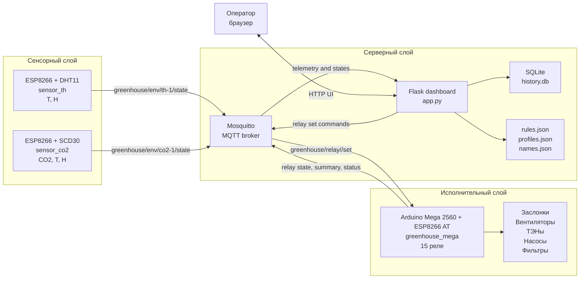
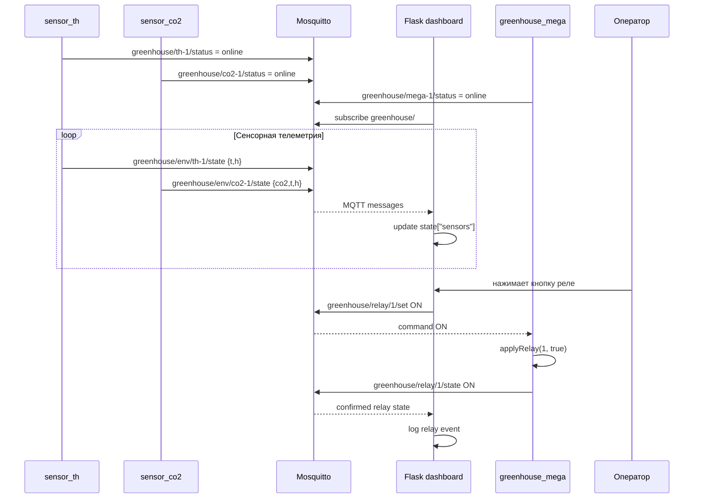
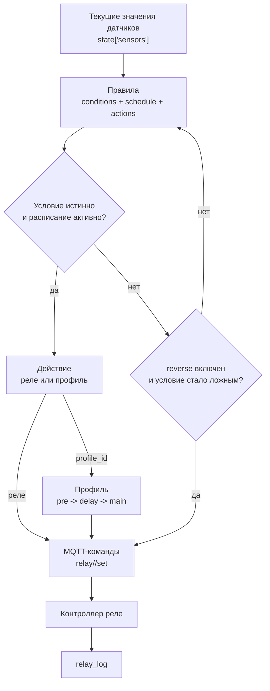
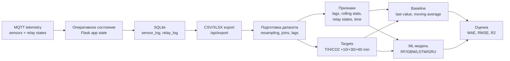
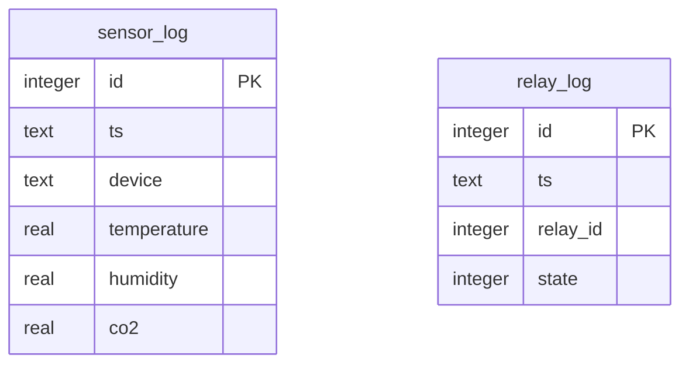

# Диаграммы для ВКР

Файл содержит исходники схем в формате Mermaid. Их можно вставить в Markdown-редактор с поддержкой Mermaid или экспортировать в PNG/SVG для финального документа.

## Рисунок 1. Общая архитектура системы

Назначение: использовать в главе 2 при описании распределенной архитектуры.

## Рисунок 2. MQTT-обмен сообщениями

Назначение: использовать в разделе 2.3 или приложении В.

## Рисунок 3. Контур правил и профилей

Назначение: использовать в разделе 2.7 или 3.6.

## Рисунок 4. Накопление данных и ML-пайплайн

Назначение: использовать в разделе 3.8 или приложении Ж.

## Рисунок 5. SQLite-структура истории

Назначение: использовать в приложении Г.

## Как экспортировать

Варианты:

1. Вставить Mermaid-блоки в Markdown-редактор с поддержкой Mermaid и экспортировать страницу.
2. Использовать Mermaid CLI, если он установлен локально.
3. Перерисовать схемы вручную в редакторе, сохранив структуру узлов и подписей из этого файла.
